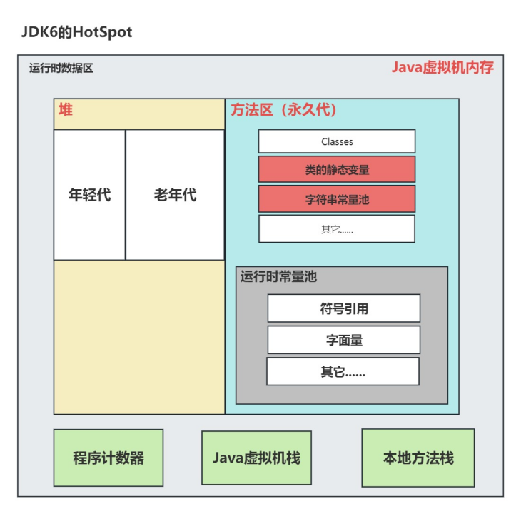
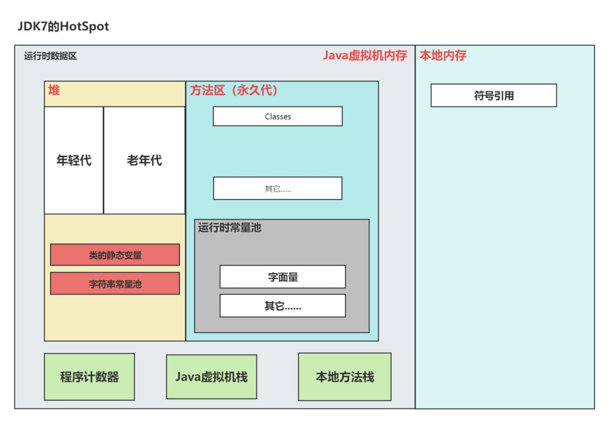
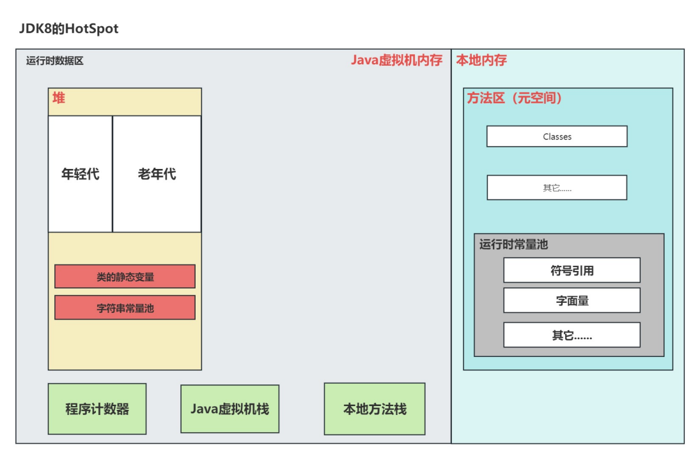
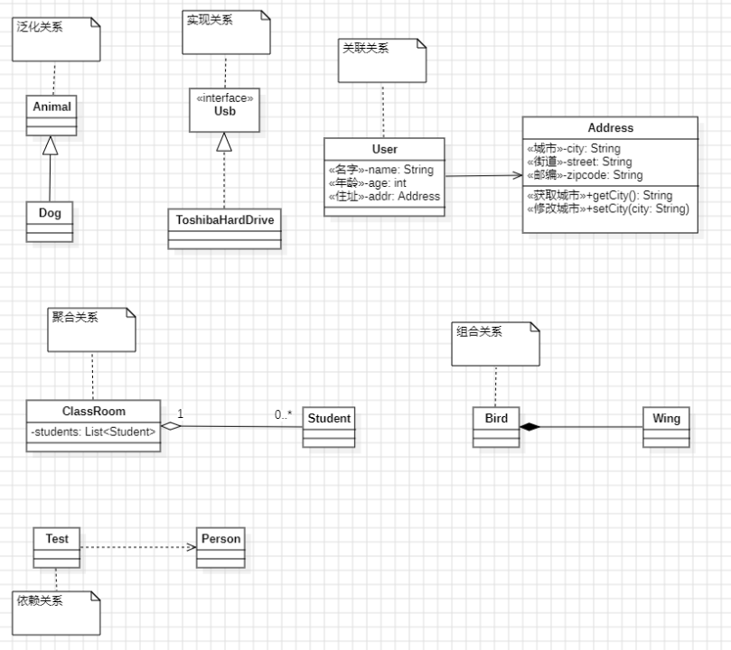

---
prev:
  text: "Java 基础语法"
  link: "/backend/java/java02"

next:
  text: "数组"
  link: "/backend/java/java04"
---

# 3. 类和对象

## 3.1 面向对象概述 :star:

面向对象三大特征:

- 封装（Encapsulation）
- 继承（Inheritance）
- 多态（Polymorphism）

## 3.2 对象的创建和使用 :white_check_mark:

### 语法格式

```java
[修饰符列表] class 类名 {
    // 属性（描述状态）
    // 方法（描述行为动作）
}
```

```java
public class Student {
    // 姓名
    String name; // 实例变量
    // 年龄
    int age;
    // 性别
    boolean gender;
    // 学习
    public void study() {
        System.out.println(“正在学习”);
    } // 实例方法
}
```

实例变量属于成员变量，成员变量如果没有手动赋值，系统会默认赋值：
| <div style="width:200px">数据类型</div> | <div style="width:300px">默认值</div> |
| :-------------------------------------: | :-----------------------------------: |
| byte | 0 |
| short | 0 |
| int | 0 |
| long | 0 |
| float | 0 |
| double | 0 |
| boolean | 0 |
| char | \u0000 |
| 引用数据类型 | null |

### 对象的创建和使用

```java
Student s = new Student();
```

在 Java 中，使用 class 定义的类，属于引用数据类型。所以 Student 属于引用数据类型。类型名为：Student。Student s; 表示定义一个变量。数据类型是 Student。变量名是 s。

对象的使用:

读取属性值：s.name

修改属性值：s.name = “jackson”;

通过一个类可以实例化多个对象:

```java
Student s1 = new Student();
Student s2 = new Student();
```

### 对象的内存分析（对象与引用）

- new 运算符会在 JVM 的堆内存中分配空间用来存储实例变量。new 分配的空间就是 Java 对象。
- 在 JVM 中对象创建后会有对应的内存地址，将内存地址赋值给一个变量，这个变量被称为引用。
- Java 中的 GC 主要针对的是 JVM 的堆内存。
- 空指针异常是如何发生的？
- 方法调用时参数是如何传递的？将变量中保存的值复制一份传递过去。
- 初次认识 this 关键字：出现在实例方法中，代表当前对象。“this.” 大部分情况下可以省略。
- this 存储在实例方法栈帧的局部变量表的 0 号槽位上。

## 3.3 封装 :white_check_mark:

### 什么是封装？

封装是一种将数据和方法加以包装，使之成为一个独立的实体，并且把它与外部对象隔离开来的机制。具体来说，封装是将一个对象的所有“状态（属性）”以及“行为（方法）”统一封装到一个类中，从而隐藏了对象内部的具体实现细节，向外界提供了有限的访问接口，以实现对对象的保护和隔离。

### 封装的好处？

封装通过限制外部对对象内部的直接访问和修改，保证了数据的安全性，并提高了代码的可维护性和可复用性。

### 在代码上如何实现封装？

属性私有化，对外提供 getter 和 setter 方法。

## 3.4 构造方法 :white_check_mark:

**构造方法有什么作用？**

- 构造方法的执行分为两个阶段：对象的创建和对象的初始化。这两个阶段不能颠倒，也不可分割。
- 在 Java 中，当我们使用关键字 new 时，就会在内存中创建一个新的对象，虽然对象已经被创建出来了，但还没有被初始化。而初始化则是在执行构造方法体时进行的。

**构造方法如何定义？**

[修饰符列表] 构造方法名(形参){}

构造方法名和类名一致。构造方法不需要提供返回值类型。

**构造方法如何调用？**

new 构造方法名(实参);

构造方法执行结束后，会自动将创建的对象的内存地址返回（方法体内不需要写 return 语句）。

**关于无参数构造方法**：

如果一个类没有显示的定义任何构造方法，系统会默认提供一个无参数构造方法，也被称为缺省构造器。一旦显示的定义了构造方法，则缺省构造器将不存在。为了方便对象的创建，建议将缺省构造器显示的定义出来。
构造方法支持重载机制。

**关于构造代码块**：

```java
{
    //...
}
```

构造代码块在 new 操作，先执行一次构造代码块。构造代码块在构造方法执行之前执行。

构造代码块的作用：如果所有的构造方法有相同的部分代码，可以将公共的代码提取到构造代码块中，便于代码复用。

**对象的创建和初始化过程**：

- new 的时候在堆内存中开辟空间，给所有属性赋默认值；
- 执行构造代码块进行初始化；
- 执行构造方法体进行初始化；
- 构造方法执行结束，对象初始化完毕。

## 3.5 this 关键字 :white_check_mark:

- this 是一个关键字。
- this 出现在实例方法中，代表当前对象。语法是：this.
- **this 本质上是一个引用，该引用保存当前对象的内存地址**。
- 通过 `this.` 可以访问实例变量，可以调用实例方法。
- this 存储在栈帧的局部变量表的第 0 个槽位上。
- this. 大部分情况下可以省略，用于区分局部变量和实例变量时不能省略。
- this 不能出现在静态方法中。
- `this(实参)` 语法：
  - 只能出现在构造方法的第一行；
  - 通过当前构造方法去调用本类中其他的构造方法；
  - 作用：代码复用。

## 3.6 static 关键字 :white_check_mark:

- static 是一个关键字，翻译为：静态的。
- static 修饰的变量叫做静态变量。当所有对象的某个属性的值是相同的，建议将该属性定义为静态变量，来节省内存的开销。
- 静态变量在类加载时初始化，存储在堆中。
- static 修饰的方法叫做静态方法。
- 所有静态变量和静态方法，统一使用“类名.”调用。虽然可以使用“引用.”来调用，但实际运行时和对象无关，所以不建议这样写，因为这样写会给其他人造成疑惑。
- 使用“引用.”访问静态相关的，即使引用为 null，也不会出现空指针异常。
- 静态方法中不能使用 this 关键字。因此无法直接访问实例变量和调用实例方法。
- 静态代码块在类加载时执行，一个类中可以编写多个静态代码块，遵循自上而下的顺序依次执行。
- 静态代码块代表了类加载时刻，如果你有代码需要在此时刻执行，可以将该代码放到静态代码块中。

## 3.7 JVM 体系结构 :rocket:

#### JVM 规范

JVM 对应了一套规范（Java 虚拟机规范），它可以有不同的实现。JVM 规范是一种抽象的概念，它可以有多种不同的实现。例如：

我们主要研究运行时数据区。运行时数据区包括 6 部分：

- The pc Register（程序计数器）
- Java Virtual Machine Stacks（Java 虚拟机栈）
- Heap（堆）
- Method Area（方法区）
- Run-Time Constant Pool（运行时常量池）
- Native Method Stacks（本地方法栈）

### JVM 规范中的运行时数据区

1. The pc Register（程序计数器）：是一块较小的内存空间，此计数器记录的是正在执行的虚拟机字节码指令的地址；
2. Java Virtual Machine Stacks（Java 虚拟机栈）：Java 虚拟机栈用于存储栈帧。栈帧用于存储局部变量表、操作数栈、动态链接、方法出口等信息。
3. Heap（堆）：是 Java 虚拟机所管理的最大的一块内存。堆内存用于存放 Java 对象实例以及数组。堆是垃圾收集器收集垃圾的主要区域。
4. Method Area（方法区）：用于存储已被虚拟机加载的类信息、常量、静态变量、即时编译器编译后的代码等数据。
5. Run-Time Constant Pool（运行时常量池）：是方法区的一部分，用于存放编译期生成的各种字面量与符号引用。
6. Native Method Stacks（本地方法栈）：在本地方法的执行过程中，会使用到本地方法栈。和 Java 虚拟机栈十分相似。

总结：这些运行时数据区虽然在功能上有所区别，但在整个 Java 虚拟机启动时都需要被创建，并且在虚拟机运行期间始终存在，直到虚拟机停止运行时被销毁。同时，不同的 JVM 实现对运行时数据区的分配和管理方式也可能不同，会对性能和功能产生影响。

### JVM 体系结构图（JVM 规范）


### JVM 规范的实现

HotSpot（Oracle JDK/Open JDK 内部使用的 JVM 就是 HotSpot）。以下是 JDK6 的 HotSpot:

- 年轻代：刚 new 出来的对象放在这里。
- 老年代：经过垃圾回收之后仍然存活的对象。
- 符号引用：类全名，字段全名，方法全名等。
- 这个时期的永久代和堆是相邻的，使用连续的物理内存，但是内存空间是隔离的。
- 永久代的垃圾收集是和老年代捆绑在一起的，因此无论谁满了，都会触发永久代和老年代的垃圾收集。



以下是 JDK7 的 HotSpot，这是一个过渡的版本，该版本相对于 JDK6 来说，变化如下：

- 类的静态变量转移到堆中了
- 字符串常量池转移到堆中了
- 运行时常量池中的符号引用转移到本地内存了



以下是 JDK8 及更高版本的 HotSpot，相对于 JDK7 来说发生了如下变化：

- 彻底删除永久代（为了避免 OOM-Out Of Memory 错误的发生）
- 将方法区的实现转移到本地内存
- 将符号引用重新放回运行时常量池



## 3.8 单例模式 :white_check_mark:

### 设计模式概述

1. 什么是设计模式？

设计模式（Design Pattern）是一套被广泛接受的、经过试验验证的、可反复使用的基于面向对象的软件设计经验总结，它是软件开发人员在软件设计中，对常见问题的解决方案的总结和抽象。设计模式是针对软件开发中常见问题和模式的通用解决方案。

2. 设计模式有哪些？

- GoF 设计模式：《Design Patterns: Elements of Reusable Object-Oriented Software》（即后述《设计模式》一书），由 Erich Gamma、Richard Helm、Ralph Johnson 和 John Vlissides 合著（Addison-Wesley，1995）。这几位作者常被称为四人组（Gang of Four）。
- 架构设计模式（Architectural Pattern）：主要用于软件系统的整体架构设计，包括多层架构、MVC 架构、微服务架构、REST 架构和大数据架构等。
- 企业级设计模式（Enterprise Pattern）：主要用于企业级应用程序设计，包括基于服务的架构（SOA）、企业集成模式（EIP）、业务流程建模（BPM）和企业规则引擎（BRE）等。
- 领域驱动设计模式（Domain Driven Design Pattern）：主要用于领域建模和开发，包括聚合、实体、值对象、领域事件和领域服务等。
- 并发设计模式（Concurrency Pattern）：主要用于处理并发性问题，包括互斥、线程池、管道、多线程算法和 Actor 模型等。
- 数据访问模式（Data Access Pattern）：主要用于处理数据访问层次结构，包括数据访问对象（DAO）、仓库模式和活动记录模式等。

3. GoF 设计模式的分类？

- 创建型：主要解决对象的创建问题；
- 结构型：通过设计和构建对象之间的关系，以达到更好的重用性、扩展性和灵活性；
- 行为型：主要用于处理对象之间的算法和责任分配。

### 单例模式

单例模式（GoF 23 种设计模式之一，最简单的设计模式：如何保证某种类型的对象只创建一个）。

- 饿汉式: 类加载时就创建对象。

```java
public class Singleton {
  // 在类加载的时候就创建实例
    private static Singleton instance = new Singleton();
    // 将构造方法设为私有化
    private Singleton() {}
    // 提供一个公有的静态方法，以获取实例
    public static Singleton getInstance() {
        return instance;
    }
}
```

- 懒汉式：第一次调用 get 方法时才会创建对象。

```java
public class Singleton {
    // 声明一个静态的、私有的该类类型的变量，用于存储该类的实例
    private static Singleton instance;
    // 将构造方法设为私有化
    private Singleton() {}
    // 提供一个公有的静态方法，以获取实例
    public static Singleton getInstance() {
        if (instance == null) { // 第一次调用该方法时，才真正创建实例
            instance = new Singleton(); // 创建实例
        }
        return instance;
    }
}
```

## 3.9 继承 :white_check_mark:

- 面向对象三大特征之一：继承
- 继承作用？
  - 基本作用：代码复用
  - 重要作用：有了继承，才有了方法覆盖和多态机制。
- 继承在 java 中如何实现？

```java
[修饰符列表] class 类名 extends 父类名{}
// extends翻译为扩展。表示子类继承父类后，子类是对父类的扩展。
```

- 继承相关的术语：当 B 类继承 A 类时
  - A 类称为：父类、超类、基类、superclass
  - B 类称为：子类、派生类、subclass
- Java 只支持单继承，一个类只能直接继承一个类。
- Java 不支持多继承，但支持多重继承（多层继承）。
- 子类继承父类后，除私有的不支持继承、构造方法不支持继承。其它的全部会继承。
- 一个类没有显示继承任何类时，默认继承 `java.lang.Object` 类。

## 3.10 方法覆盖 :star:

方法覆盖（override）/方法重写（overwrite）

1. 什么情况下考虑使用方法覆盖？

当从父类中继承过来的方法无法满足当前子类的业务需求时。

2. 发生方法覆盖的条件？

- 具有继承关系的父子类之间
- 相同的返回值类型，相同的方法名，相同的形式参数列表
- 访问权限不能变低，可以变高。
- 抛出异常不能变多，可以变少。
- 返回值类型可以是父类方法返回值类型的子类。

3. 方法覆盖的小细节：

- `@Override` 注解标注的方法会在编译阶段检查该方法是否重写了父类的方法。
- 私有方法不能继承，所以不能覆盖。
- 构造方法不能继承，所以不能覆盖。
- 静态方法不存在方法覆盖，方法覆盖针对的是实例方法。
- 方法覆盖说的实例方法，和实例变量无关。
- 如果返回值类型是引用数据类型，那么这个返回值类型可以是原类型的子类型。
- 抛出异常不能变多，可以变少。

4. 方法重写的条件：

- 方法覆盖发生在具有继承关系的父子类之间；
- 具有相同的方法名；
- 具有相同的形参列表；
- 具有相同的返回值类型；

## 3.11 多态 :white_check_mark:

### 什么是向上转型和向下转型？

- java 允许具有继承关系的父子类型之间的类型转换。
- 向上转型（upcasting）：子-->父（可看作自动类型转换）
  - 子类型的对象可以赋值给一个父类型的引用。
- 向下转型（downcasting）：父-->子（可看作强制类型转换）
  - 父类型的引用可以转换为子类型的引用。但是需要加强制类型转换符。
- 无论是向上转型还是向下转型，前提条件是：两种类型之间必须存在继承关系。这样编译器才能编译通过。

### 什么是多态？

- 父类型引用指向子类对象。

```java
Animal a = new Cat();
a.move();
```

- 程序分为编译阶段和运行阶段：
  - 编译阶段：编译器只知道 a 是 Animal 类型，因此去 Animal 类中找 move()方法，找到之后，绑定成功，编译通过。这个过程通常被称为静态绑定。
  - 运行阶段：运行时和 JVM 堆内存中的真实 Java 对象有关，所以运行时会自动调用真实对象的 move()方法。这个过程通常被称为动态绑定。
- 多态指的是：多种形态，编译阶段一种形态，运行阶段另一种形态，因此叫做多态。

### 多态的基础语法

- 向下转型我们需要注意什么？
  - 向下转型时，使用不当，容易发生类型转换异常：ClassCastException。
  - 在向下转型时，一般建议使用 instanceof 运算符进行判断来避免 ClassCastException 的发生。
- `instanceof` 运算符的使用
  - 语法格式：(引用 instanceof 类型)
  - 执行结果是 true 或者 false
  - 例如：(a instanceof Cat)。如果结果是 true：表示 a 引用指向的对象是 Cat 类型的。如果结果是 false：表示 a 引用指向的对象不是 Cat 类型的。

### 软件开发七大原则

- 软件开发原则旨在引导软件行业的从业者在代码设计和开发过程中，遵循一些基本原则，以达到高质量、易维护、易扩展、安全性强等目标。软件开发原则与具体的编程语言无关的，属于软件设计方面的知识。

- 软件开发七大原则？
  1. 开闭原则 (Open-Closed Principle，OCP)：一个软件实体应该对扩展开放，对修改关闭。即在不修改原有代码的基础上，通过添加新的代码来扩展功能。（最基本的原则，其它原则都是为这个原则服务的。）
  2. 单一职责原则：一个类只负责单一的职责，也就是一个类只有一个引起它变化的原因。
  3. 里氏替换原则：子类对象可以替换其基类对象出现的任何地方，并且保证原有程序的正确性。
  4. 接口隔离原则：客户端不应该依赖它不需要的接口。
  5. 依赖倒置原则：高层模块不应该依赖底层模块，它们都应该依赖于抽象接口。换言之，面向接口编程。
  6. 迪米特法则：一个对象应该对其它对象保持最少的了解。即一个类应该对自己需要耦合或调用的类知道得最少。
  7. 合成复用原则：尽量使用对象组合和聚合，而不是继承来达到复用的目的。组合和聚合可以在获取外部对象的方法中被调用，是一种运行时关联，而继承则是一种编译时关联。

### 多态在开发中的作用

- 降低程序的耦合度，提高程序的扩展力。
- 尽量使用多态，面向抽象编程，不要面向具体编程。

## 3.12 super 关键字 :white_check_mark:

1. super 关键字和 this 关键字对比来学习。this 代表的是当前对象。super 代表的是当前对象中的父类型特征。
2. super 不能使用在静态上下文中。
3. “super.”大部分情况下是可以省略的。什么时候不能省略？

- 当父类和子类中定义了相同的属性（实例变量）或者相同方法（实例方法）时，如果需要在子类中访问父类的属性或方法时，super. 不能省略。

4. this 可以单独输出，super 不能单独输出。
5. super(实参); 通过子类的构造方法调用父类的构造方法，目的是为了完成父类型特征的初始化。
6. 当一个构造方法第一行没有显示的调用“super(实参);”，也没有显示的调用“this(实参)”，系统会自动调用 super()。因此一个类中的无参数构造方法建议显示的定义出来。
7. super(实参); 这个语法只能出现在构造方法第一行。
8. 在 Java 语言中只要 new 对象，Object 的无参数构造方法一定会执行。

## 3.13 final 关键字 :white_check_mark:

- final 修饰的类不能被继承。
- final 修饰的方法不能被覆盖。
- final 修饰的变量，一旦赋值不能重新赋值。
- final 修饰的实例变量必须在对象初始化时手动赋值。
- final 修饰的实例变量一般和 static 联合使用，称为**常量**。

```java
static final double MATH_PI = 3.1415926;
```

- final 修饰的引用，一旦指向某个对象后，不能再指向其它对象。但指向的对象内部的数据是可以修改的。

## 3.14 抽象类 :white_check_mark:

- 什么时候考虑将类定义为抽象类？

  - 如果类中有些方法无法实现或者没有意义，可以将方法定义为抽象方法。类定义为抽象类。这样在抽象类中只提供公共代码，具体的实现强行交给子类去做。比如一个 Person 类有一个问候的方法 greet()，但是不同国家的人问候的方式不同，因此 greet() 方法具体实现应该交给子类。再比如主人喂养宠物的例子中的宠物 Pet，Pet 中的 eat() 方法的方法体就是没有意义的。

- 抽象类如何定义？

```java
abstract class 类名{}
```

- 抽象类有构造方法，但无法实例化。抽象类的构造方法是给子类使用的。
- 抽象方法如何定义？

```java
abstract 方法返回值类型 方法名(形参);
```

- 抽象类中不一定有抽象方法，但如果有抽象方法那么类要求必须是抽象类。
- 一个非抽象的类继承抽象类，要求必须将抽象方法进行实现/重写。
- abstract 关键字不能和 private，final，static 关键字共存。

## 3.15 接口 :white_check_mark:

### 接口的基础语法

- 接口（interface）在 Java 中表示一种规范或契约，它定义了一组抽象方法和常量，用来描述一些实现这个接口的类应该具有哪些行为和属性。接口和类一样，也是一种引用数据类型。
- 接口怎么定义？

```java
[修饰符列表] interface 接口名{}
```

- 抽象类是半抽象的，接口是完全抽象的。**接口没有构造方法，也无法实例化**。
- 接口中只能定义：**常量 + 抽象方法**。接口中的常量的 static final 可以省略。接口中的抽象方法的 abstract 可以省略。接口中所有的方法和变量都是 public 修饰的。(JDK8 之前的语法规则)
- 接口和接口之间可以多继承。
- 类和接口的关系我们叫做**实现（implements）**（这里的实现也可以等同看做继承）。使用 `implements` 关键字进行接口的实现。
- 一个非抽象的类实现接口**必须将接口中所有的抽象方法全部实现**。
- 一个类可以实现多个接口。语法：

```java
class 类 implements 接口A, 接口B {}
```

- Java8 之后，接口中允许出现**默认方法(default)**和**静态方法**(JDK8 新特性)
  - 引入默认方式是为了解决接口演变问题：接口可以定义抽象方法，但是不能实现这些方法。所有实现接口的类都必须实现这些抽象方法。这会导致接口升级的问题：当我们向接口添加或删除一个抽象方法时，这会破坏该接口的所有实现，并且所有该接口的用户都必须修改其代码才能适应更改。这就是所谓的"接口演变"问题。
  - 引入的静态方法只能使用本接口名来访问，无法使用实现类的类名访问。
- JDK9 之后允许接口中定义私有的实例方法（为默认方法服务的）和私有的静态方法（为静态方法服务的）。
- 所有的接口隐式的继承 Object。因此接口也可以调用 Object 类的相关方法。

### 接口的作用

- 面向接口调用的称为：接口调用者
- 面向接口实现的称为：接口实现者
- 调用者和实现者通过接口达到了**解耦合**。也就是说调用者不需要关心具体的实现者，实现者也不需要关心具体的调用者，双方都遵循规范，面向接口进行开发。
- 面向抽象编程，面向接口编程，可以降低程序的耦合度，提高程序的扩展力。
- 例如定义一个 Usb 接口，提供 read() 和 write() 方法，通过 read() 方法读，通过 write() 方法写：
  定义一个电脑类 Computer，它是调用者，面向 Usb 接口来调用。Usb 接口的实现可以有很多，例如：打印机（Printer），硬盘（HardDrive）。

```java
public class Computer {
  public void conn(Usb usb) {
    usb.read();
    usb.write();
  }
}
```

### 接口与抽象类如何选择

抽象类和接口虽然在代码角度都能达到同样的效果，但适用场景不同：

- **抽象类主要适用于公共代码的提取**。当多个类中有共同的属性和方法时，为了达到代码的复用，建议为这几个类提取出来一个父类，在该父类中编写公共的代码。如果有一些方法无法在该类中实现，可以延迟到子类中实现。这样的类就应该使用抽象类。
- **接口主要用于功能的扩展**。例如有很多类，一些类需要这个方法，另外一些类不需要这个方法时，可以将该方法定义到接口中。需要这个方法的类就去实现这个接口，不需要这个方法的就可以不实现这个接口。接口主要规定的是行为。

## 3.16 类之间的关系 :star:

### UML

1. UML（Unified Modeling Language，统一建模语言）是一种用于面向对象软件开发的图形化的建模语言。它由 Grady Booch、James Rumbaugh 和 Ivar Jacobson 等三位著名的软件工程师所开发，并于 1997 年正式发布。UML 提供了一套通用的图形化符号和规范，帮助开发人员以图形化的形式表达软件设计和编写的所有关键方面，从而更好地展示软件系统的设计和实现过程。
2. UML 是一种图形化的语言，类似于现实生活中建筑工程师画的建筑图纸，图纸上有特定的符号代表特殊的含义。
3. UML 不是专门为 java 语言准备的。只要是面向对象的编程语言，开发前的设计，都需要画 UML 图进行系统设计。（设计模式、软件开发七大原则等同样也不是只为 java 语言准备的。）
4. UML 图包括：

- **类图（Class Diagram）**：描述软件系统中的类、接口、关系和其属性等；
- **用例图（Use Case Diagram）**：描述系统的功能需求和用户与系统之间的关系；
- **序列图（Sequence Diagram）**：描述对象之间的交互、消息传递和时序约束等；
- **状态图（Statechart Diagram）**：描述类或对象的生命周期以及状态之间的转换；
- 对象图（Object Diagram）：表示特定时间的系统状态，并显示其包含的对象及其属性；
- 协作图（Collaboration Diagram）：描述对象之间的协作，表示对象之间相互合作来完成任务的关系；
- 活动图（Activity Diagram）：描述系统的动态行为和流程，包括控制流和对象流；
- 部署图（Deployment Diagram）：描述软件或系统在不同物理设备上部署的情况，包括计算机、网络、中间件、应用程序等。

5. 常见的 UML 建模工具有：StarUML，Rational Rose 等。

### 类之间的关系

1. 泛化关系（is a）
2. 实现关系（is like a）
3. 关联关系（has a）
4. 聚合关系

聚合关系指的是一个类包含、合成或者拥有另一个类的实例，而这个实例是可以独立存在的。聚合关系是一种弱关联关系，表示整体与部分之间的关系。例如一个教室有多个学生

5. 组合关系（Composition）

组合关系是聚合关系的一种特殊情况，表示整体与部分之间的关系更加强烈。组合关系指的是一个类包含、合成或者拥有另一个类的实例，而这个实例只能同时存在于一个整体对象中。如果整体对象被销毁，那么部分对象也会被销毁。例如一个人对应四个肢体。

6. 依赖关系（Dependency）

依赖关系是一种临时性的关系，当一个类使用另一个类的功能时，就会产生依赖关系。如果一个类的改变会影响到另一个类的功能，那么这两个类之间就存在依赖关系。依赖关系是一种较弱的关系，可以存在多个依赖于同一个类的对象。例如 A 类中使用了 B 类，但是 B 类作为 A 类的方法参数或者局部变量等。



## 3.17 访问控制权限 :white_check_mark:

|  修饰符   | 同一个类 | 同一个包 | 子类 | 所有类 |
| :-------: | :------: | :------: | :--: | :----: |
|  private  |    ✔️    |    -     |  -   |   -    |
|   缺省    |    ✔️    |    ✔️    |  -   |   -    |
| protected |    ✔️    |    ✔️    |  ✔️  |   -    |
|  public   |    ✔️    |    ✔️    |  ✔️  |   ✔️   |

- private：私有的，只能在本类中访问。
- 缺省：默认的，同一个包下可以访问。
- protected：受保护的，子类中可以访问（受保护的通常就是给子孙用的）。
- public：公共的，在任何位置都可以访问。

- 类中的属性和方法访问权限共有四种：private、缺省、protected 和 public。
- 类的访问权限只有两种：public 和缺省。
- 访问权限控制符不能修饰**局部变量**。

## 3.18 Object 类 :white_check_mark:

1. `java.lang.Object` 是所有类的超类。java 中所有类都实现了这个类中的方法。
2. Object 类是我们学习 JDK 类库的第一个类。通过这个类的学习要求掌握会查阅 API 帮助文档。
3. 现阶段 Object 类中需要掌握的方法：

- toString：将 java 对象转换成字符串表示形式。

```java
// 原码内部默认实现
public String toString() {
  return getClass().getName() + "@" + Integer.toHexString(hashCode());
}
```

println() 输出一个引用时，会自动调用 `引用.toString()`。

- equals：判断两个对象是否相等。

1. 现阶段 Object 类中需要了解的方法：

- hashCode：返回一个对象的哈希值，通常作为在哈希表中查找该对象的键值。Object 类的默认实现是根据对象的内存地址生成一个哈希码（即将对象的内存地址转换为整数作为哈希值）。hashCode() 方法是为了 HashMap、Hashtable、HashSet 等集合类进行优化而设置的，以便更快地查找和存储对象。

```java
// hashCode() 方法在 Object 类中的默认实现:
public native int hashCode();
// 这是一个本地方法，底层调用了 C++ 写的动态链接库程序
```

- finalize：当 java 对象被回收时，由 GC 自动调用被回收对象的 finalize 方法，通常在该方法中完成销毁前的准备。（JDK9 以后废弃）
- clone：对象的拷贝（浅拷贝，深拷贝）。protected 修饰的只能在同一个包下或者子类中访问。只有实现了 Cloneable 接口的对象才能被克隆。

```java
// 浅拷贝：在子类中对 clone() 方法重写
@Override
public Object clone() throws CloneNotSupportedException {
  return super.clone();
}
```

```java
// 深拷贝
@Override
public Object clone() throws CloneNotSupportedException {
  Address copyAddr = (Address)this.getAddr().clone();
  User copyUser = (User)super.clone();
  copyUser.setAddr(copyAddr);
  return copyUser;
}
```

## 3.19 内部类 :white_check_mark:

### 什么是内部类？

定义在一个类中的类。

### 什么时候使用内部类？

1. 一个类用到了另外一个类，而这两个类的联系比较密切，但是如果把这两个类定义为独立的类，不但增加了类的数量，也不利于代码的阅读和维护。
2. 内部类可以访问外部类的私有成员，这样可以将相关的类和接口隐藏在外部类的内部，从而提高封装性。
3. 匿名内部类是指没有名字的内部类，通常用于定义一个只使用一次的类，比如在事件处理中。

### 内部类包括哪几种？

1. **静态内部类**：和静态变量一个级别

- 静态内部类如何实例化：

```java
  OuterClass.StaticInnerClass staticInnerClass
      = new OuterClass.StaticInnerClass();
```

- 无法直接访问外部类中实例变量和实例方法。

2. **实例内部类**：和实例变量一个级别

- 实例内部类如何实例化：

```java
  OuterClass.InnerClass innerClass
      = new OuterClass().new InnerClass();
```

- 可以直接访问外部类中所有的实例变量，实例方法，静态变量，静态方法。

3. **局部内部类**：和局部变量一个级别

- 局部内部类不能使用访问权限修饰符修饰。
- 局部内部类访问类外部的局部变量时，局部变量需要被 final 修饰（自动添加）。
- 从 JDK8 开始，不需要手动添加 final 了，但 JVM 会自动添加。

4. **匿名内部类**：特殊的局部内部类，没有名字，只能用一次。

```java
// Usb 为接口
computer.conn(new Usb() {
  @Override
  public void read() {
    //...
  }

  @Override
  public void write() {
    //...
  }
});
```

<a-back-top />
