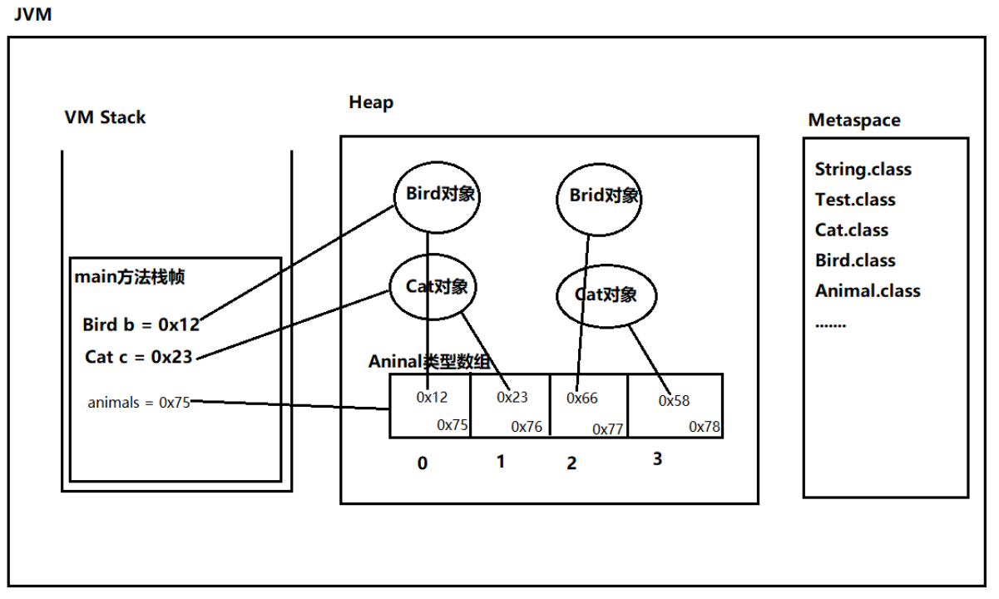

---
prev:
  text: "类和对象"
  link: "/backend/java/java03"

next:
  text: "异常"
  link: "/backend/java/java05"
---

# 4. 数组

## 4.1 数组概述

### 什么是数组？

- 在 Java 中，数组是一种用于存储多个相同数据类型元素的容器。
- 例如一个存储整数的数组：`int[] nums = {100, 200, 300};`
- 例如一个存储字符串的数组：`String[] names = {“jack”,“lucy”,“lisi”};`
- 数组是一种引用数据类型，隐式继承 Object。因此数组也可以调用 Object 类中的方法。
- 数组对象存储在堆内存中。


### 数组的分类？

- 根据维数进行分类：一维数组，二维数组，三维数组，多维数组。
- 根据数组中存储的元素类型分类：基本类型数组，引用类型数组。
- 根据数组初始化方式不同分类：静态数组，动态数组。

### Java 数组存储元素的特点？

- 数组长度一旦确定不可变。
- 数组中元素数据类型一致，每个元素占用空间大小相同。
- 数组中每个元素在空间存储上，内存地址是连续的。
- 每个元素有索引，首元素索引 0，以 1 递增。
- 以首元素的内存地址作为数组对象在堆内存中的地址。
- 所有数组对象都有 length 属性用来获取数组元素个数。末尾元素下标：length-1。

### 数组的优缺点

1. 数组优点

- 根据下标查询某个元素的效率极高。数组中有 100 个元素和有 100 万个元素，查询效率相同。时间复杂度 O(1)。也就是说在数组中根据下标查询某个元素时，不管数组的长短，耗费时间是固定不变的。
- 原因：知道首元素内存地址，元素在空间存储上内存地址又是连续的，每个元素占用空间大小相同，只要知道下标，就可以通过数学表达式计算出来要查找元素的内存地址。直接通过内存地址定位元素。

2. 数组缺点

- 随机增删元素的效率较低。因为随机增删元素时，为了保证数组中元素的内存地址连续，就需要涉及到后续元素的位移问题。时间复杂度 O(n)。O(n)表示的是线性阶，随着问题规模 n 的不断增大，时间复杂度不断增大，算法的执行效率越低。（不过需要注意的是：对数组末尾元素的增删效率是不受影响的。）
- 无法存储大量数据，因为很难在内存上找到非常大的一块连续的内存。

## 4.2 一维数组

1. 一维数组是线性结构。二维数组，三维数组，多维数组是非线性结构。
2. 如何静态初始化一维数组？

- 第一种：`int[] arr = {55,67,22};` 或者 `int arr[] = {55,67,22};`
- 第二种：`int[] arr = new int[]{55,67,22};`

3. 如何访问数组中的元素？

- 通过下标来访问。
- 注意 `ArrayIndexOutOfBoundsException` 异常的发生。

4. 如何遍历数组？

- 普通 for 循环遍历
- for-each 遍历（优点是代码简洁。缺点是没有下标。）

5. 如何动态初始化一维数组？

- `int[] arr = new int[4];`
- `Object[] objs = new Object[5];`
- 数组动态初始化的时候，确定长度，并且数组中每个元素采用默认值。

:::tip

1. 方法在调用时如何给方法传一个数组对象？

```java
  // 方式一：
  int[] arr = {1,2,3,4};
  display(arr);
  // 方式二：
  display(new int[]{1,2,3,4});
  // 方式三：
  display(new int[10]);
```

2. 当一维数组中存储引用时的内存图
   
3. 如何获取数组中的最大值？

- 假设首元素是最大的，然后遍历数组中所有元素，只要有更大的，就将其作为最大值。
- 思考：找出最大值的下标怎么做？

4. 如果知道值，如何通过值找它的下标？
5. 如何将数组中的所有元素反转？

- 第一种方式：创建一个新的数组。
- 第二种方式：首位交换。

6. 关于 main 方法的形参 args？

- 接收命令行参数
- 在 DOS 命令窗口中怎么传？在 IDEA 中怎么传？(Edit Configurations)

7. 关于方法的可变长度参数？

- 可变长参数只能出现在形参列表中的最后一个位置。
- 可变长参数可以当做数组来处理。

```java
public static void sum(int... nums) {
  // ...
}
```

:::

### 一维数组的扩容

1. 数组长度一旦确定不可变。
2. 那数组应该如何扩容？

- 只能创建一个更大的数组将原数组中的数据全部拷贝到新数组中;
- 可以使用 `System.arraycopy()` 方法完成数组的拷贝。

```java{3}
int[] sourceArr = {1, 3, 5, 6, 7, 24, 66, 78, 99};
int[] newArr = new int[sourceArr.length * 2];
System.arraycopy(sourceArr, 0,newArr,0, sourceArr.length);
for (int i = 0; i < newArr.length; i++) {
    System.out.println(newArr[i]);
}
```

数组扩容会影响程序的执行效率，因此尽可能预测数据量，创建一个接近数量的数组，减少扩容次数。

## 4.3 二维数组

1. 二维数组是一个特殊的一维数组，特殊在：这个一维数组中每个元素是一个一维数组。
2. 二维数组的静态初始化

   ```java
   int[][] arr = new int[][]{{},{},{}};
   int[][] arr = {{},{},{}};
   ```

3. 二维数组的动态初始化(等长)

```java
   int[][] arr = new int[3][4];
```

4. 二维数组的动态初始化（不等长）

```java
int[][] arr = new int[3][];
```

5. 二维数组中元素的访问
   - 第一个元素：`arr[0][0]`;
   - 最后一个元素：`arr[arr.length-1][arr[arr.length-1].length-1]`。
6. 二维数组中元素的遍历
   略

## 4.4 IDEA 的 Debug 调试

- 在可能出现问题的代码附近添加断点，一般是将断点添加在方法体的某一行代码上；
- 断点可以添加多个。点一次添加一个断点。再点一次断点则消失；
- 添加断点后，如果想让程序运行到断点处停下来，需要使用 Debug 模式运行程序；
- Debug 窗口中的按钮；
- 给断点添加条件；
- Debug 窗口中的隐藏按钮

## 4.5 JUnit 单元测试

1. 什么是单元测试，为什么要进行单元测试？
   一个项目是巨大的，只有保证你写的每一块都是正确的，最后整个项目才能正常运行。这里所谓的每一块就是一个单元。
2. 做单元测试需要引入 JUnit 框架，JUnit 框架在 JDK 中没有，需要额外引入，也就是引入 JUnit 框架的 class 文件（jar 包）
3. 单元测试类（测试用例）怎么写？
   单元测试类名：XxxTest
4. 单元测试方法怎么写？

- 单元测试方法需要使用@Test 注解标注。
- 单元测试方法返回值类型必须是 void
- 单元测试方法形参个数为 0
- 建议单元测试方法名：testXxx

5. 什么是期望值，什么是实际值？

- 期望值就是在程序执行之前，你觉得正确的输出结果应该是多少
- 实际值就是程序在实际运行之后得到的结果

6. 常见注解：

- @BeforeAll @AfterAll 主要用于在测试开始之前/之后执行必要的代码。被标注的方法需要是静态的。
- @BeforeEach @AfterEach 主要用于在每个测试方法执行前/后执行必要的代码。

7. 单元测试中使用 Scanner 失效怎么办？
   选中导航栏的 `Help`，然后选中 `Edit Custom VM Options...`，接着在 `IDEA64.exe.vmoptions` 文件中添加内容 `-Deditable.java.test.console=true`，最后在重启 IDEA 即可解决。

## 4.6 数据结构与算法
略
## 4.7 数组的排序算法
略
## 4.8 数组的查找算法
略
## 4.9 Arrays 工具类
- `Arrays.toString()` 方法：将数组转换成字符串
- `Arrays.deepToString()` 方法：可以将二维数组转换成字符串
- `Arrays.equals(int[] arr1, int[] arr2)` 方法：判断两个数组是否相等
- `Arrays.equals(Object[] arr1, Object[] arr2)` 方法
- `Arrays.deepEquals(Object[] arr1, Object[] arr2)` 方法：判断两个二维数组是否相等
- `Arrays.sort(int[] arr)` 方法：基于快速排序算法，适合小型数据量排序
- `Arrays.sort(String[] arr)` 方法
- `Arrays.parallelSort(int[] arr)` 方法：基于分治的归并排序算法，支持多核CPU排序，适合大数据量排序
- `int binarySearch(int[] arr, int elt)` 方法：二分法查找
- `Arrays.fill(int[] arr, int data)` 方法：填充数组
- `Arrays.fill(int[] a, int fromIndex, int toIndex, int val)` 方法
- `int[] Arrays.copyOf(int[] original, int newLength)` 方法：数组拷贝
- `int[] Arrays.copyOfRange(int[] original, int from, int to)`
- `Arrays.asList(T... data)` 方法：将一组数据转换成List集合
