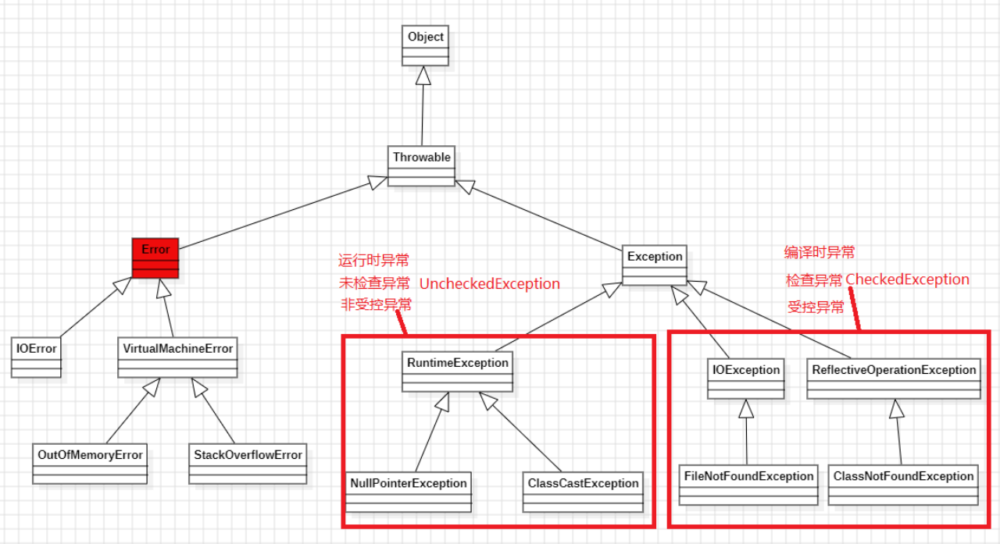

---
prev:
  text: "数组"
  link: "/backend/java/java04"

next:
  text: "常用类"
  link: "/backend/java/java06"
---

# 5. 异常

## 5.1 异常概述 :rocket:

1. 什么是异常？有什么用？

- Java 中的异常是指程序运行时出现了错误或异常情况，导致程序无法继续正常执行的现象。例如，数组下标越界、空指针异常、类型转换异常等都属于异常情况。
- Java 提供了异常处理机制，即在程序中对可能出现的异常情况进行捕捉和处理。异常机制可以帮助程序员更好地管理程序的错误和异常情况，避免程序崩溃或出现不可预测的行为。
- 没有异常机制的话，程序中就可能会出现一些难以调试和预测的异常行为，可能导致程序崩溃，甚至可能造成数据损失或损害用户利益。因此，异常机制一项非常重要的功能，是编写可靠程序的基础。

2. 异常在 Java 中以类和对象的形式存在。

## 5.2 异常继承结构 :white_check_mark:

1. 所有的异常和错误都是可抛出的。都继承了 `Throwable` 类。
2. `Error` 是无法处理的，出现后只有一个结果：JVM 终止。
3. `Exception` 是可以处理的。
4. `Exception` 的分类：

- 所有的 `RuntimeException` 的子类：运行时异常/未检查异常(UncheckedException)/非受控异常
- Exception 的子类（除 RuntimeException 之外）：编译时异常/检查异常(CheckedException)/受控异常

5. 编译时异常和运行时异常区别：

- 编译时异常特点：在编译阶段必须提前处理，如果不处理编译器报错。
- 运行时异常特点：在编译阶段可以选择处理，也可以不处理，没有硬性要求。
- 编译时异常一般是由外部环境或外在条件引起的，如网络故障、磁盘空间不足、文件找不到等。
- 运行时异常一般是由程序员的错误引起的，并且不需要强制进行异常处理。

注意：**编译时异常**并不是在编译阶段发生的异常，所有的异常发生都是在运行阶段的，因为每个异常发生都是会 new 异常对象的，new 异常对象只能在运行阶段完成。那为什么叫做编译时异常呢？这是因为这种异常必须在编译阶段提前预处理，如果不处理编译器报错，因此而得名编译时异常。


## 5.3 自定义异常 :white_check_mark:

第一步：编写异常类继承 `Exception/RuntimeException`；

第二步：提供一个无参数构造方法，再提供一个带 String msg 参数的构造方法，在构造方法中调用父类的构造方法。

```java
public class IllegalNameException extends Exception {
    public IllegalNameException() {
    }

    public IllegalNameException(String message) {
        super(message);
    }
}
```

```java
public class IllegalNameException extends RuntimeException {
    public IllegalNameException() {
    }

    public IllegalNameException(String message) {
        super(message);
    }
}
```

## 5.4 异常的处理 :white_check_mark:

### 异常处理的两种方式

1. 声明异常：类似于推卸责任的处理方式

在方法定义时使用 `throws` 关键字声明异常，告知调用者，调用这个方法可能会出现异常。这种处理方式的态度是：如果出现了异常则会抛给调用者来处理。

2. 捕捉异常：真正的处理捕捉异常

在可能出现异常的代码上使用 `try..catch` 进行捕捉处理。这种处理方式的态度是：把异常抓住。其它方法如果调用这个方法，对于调用者来说是不知道这个异常发生的。因为这个异常被抓住并处理掉了。

3. 异常在处理的整个过程中应该是：声明和捕捉联合使用。
4. 什么时候捕捉？什么时候声明？

如果异常发生后需要调用者来处理的，需要调用者知道的，则采用声明方式。否则采用捕捉。

### 声明异常 （throws 关键字）

- 如果一个异常发生后希望调用者来处理的，使用声明异常（俗话说：交给上级处理）

```java
public void m() throws AException, BException... {}
```

- 如果 AException 和 BException 都继承了 XException，那么也可以这样写：

```java
public void m() throws XException{}
```

- 调用者在调用 m() 方法时，编译器会检测到该方法上用 throws 声明了异常，表示可能会抛出异常，编译器会继续检测该异常是否为编译时异常，如果为编译时异常则必须在编译阶段进行处理，如果不处理编译器就会报错。
- 如果所有位置都采用 throws，包括 main 方法的处理态度也是 throws，如果运行时出现了异常，最终异常是抛给了 main 方法的调用者（JVM），JVM 则会终止程序的执行。因此为了保证程序在出现异常后不被中断，至少 main 方法不要再使用 throws 进行声明了。
- 发生异常后，在发生异常的位置上，往下的代码是不会执行的，除非进行了异常的捕捉。

### 捕捉异常 (try...catch...关键字)

- 如果一个异常发生后，不需要调用者知道，也不需要调用者来处理，选择使用捕捉方式处理。

```java
try {
  // 尝试执行可能会出现异常的代码
  // try块中的代码如果执行出现异常，
  // 出现异常的位置往下的代码是不会执行的，直接进入catch块执行
} catch(AException e) {
  // 如果捕捉到AException类型的异常，在这里处理
} catch(BException e) {
  // 如果捕捉到BException类型的异常，在这里处理
} catch(XException e) {
  // 如果捕捉到XException类型的异常，在这里处理
}
  // 当try..catch..将所有发生的异常捕捉后，这里的代码是会继续往下执行的。
```

- catch 可以写多个，并且遵循自上而下，从小到大。
- **Java7 新特性**：catch 后面小括号中可以编写多个异常，使用运算符 `|` 隔开。

## 5.5 异常的常用方法 :white_check_mark:

1. 获取异常的简单描述信息：

- `exception.getMessage()`;
- 获取的 message 是通过构造方法创建异常对象时传递过去的 message。

2. 打印异常堆栈信息：

- `exception.printStackTrace()`;

3. 要会看异常的堆栈信息：

- 异常信息的打印是符合栈数据结构的。
- 看异常信息主要看最开始的描述信息。看栈顶信息。

## 5.6 finally 语句块 :white_check_mark:

1. finally 语句块中的代码是一定会执行的(即使 try 代码块中含有 return 语句，finally 也会执行)。
2. finally 语句块不能单独使用，至少需要配合 try 语句块一起使用：

- `try...finally`
- `try...catch...finally`

::: tip try...finally 面试题

面试题 1：

```java
public static void m1() {
  try {
    System.out.println("try111");
    // 退出JVM
    System.exit(0);
  } finally {
    System.out.println("finally222");
  }
}

// 输出：
// try111
```

面试题 2：

```java
public static void m2() {
  int i = 100;
  try {
   return i;
  } finally {
    i++;
  }
}
int result = m2(); // 输出：100, 而不是101
```

:::

3. 通常在 finally 语句块中完成资源的释放

- 资源释放的工作比较重要，如果资源没有释放会一直占用内存。
- 为了保证资源的关闭，也就是说：不管程序是否出现异常，关闭资源的代码一定要保证执行。
- 因此在 finally 语句块中通常进行资源的释放。

4. final、finally、finalize 分别是什么？

- final 是一个关键字，修饰的类无法继承，修饰的方法无法覆盖，修饰的变量不能修改。
- finally 是一个关键字，和 try 一起使用，finally 语句块中的代码一定会执行。
- finalize 是一个标识符，它是 Object 类中的一个方法名。

## 5.7 方法覆盖与异常 :white_check_mark:

子类重写父类的方法，不能比父类方法抛出更多的异常，可以更少。

<a-back-top />
