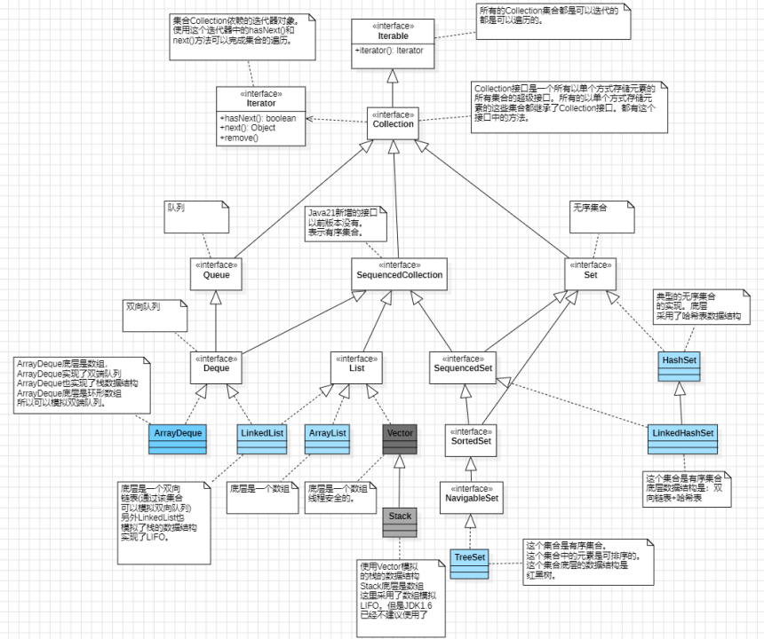

---
prev:
  text: "常用类"
  link: "/backend/java/java06"

next:
  text: "IO 流"
  link: "/backend/java/java08"
---

# 7. 集合框架

## 7.1 集合概述
1. 什么是集合，有什么用？
- 集合是一种容器，用来组织和管理数据的。非常重要。
- Java 的集合框架对应的这套类库其实就是对各种数据结构的实现。
- 每一个集合类底层采用的数据结构不同，例如 ArrayList 集合底层采用了数组，LinkedList 集合底层采用了双向链表，HashMap 集合底层采用了哈希表，TreeMap 集合底层采用了红黑树。
- 我们不用写数据结构的实现了。直接用就行了。但我们需要知道的是在哪种场合下选择哪一个集合效率是最高的。
2. 集合中存储的是引用，不是把堆中的对象存储到集合中，是把对象的地址存储到集合中。
3. 默认情况下，如果不使用泛型的话，集合中可以存储任何类型的引用，只要是 Object 的子类都可以存储。
4. Java集合框架相关的类都在 java.util 包下。
5. Java集合框架分为两部分：
- Collection 结构：元素以单个形式存储。
- Map结构：元素以键值对的映射关系存储。


## 7.2 Collection 继承结构
1. SequencedCollection 和SequencedSet 接口都是 Java21 新增的接口。
2. 右图中蓝色的是实现类。其它的都是接口。
3. 6 个实现类中只有 HashSet 是无序集合。剩下的都是有序集合。
- 有序集合：集合中存储的元素有下标或者集合中存储的元素是可排序的。
- 无序集合：集合中存储的元素没有下标并且集合中存储的元素也没有排序。
4. 每个集合实现类对应的数据结构如下：
- LinkedList: 双向链表（不是队列数据结构，但使用它可以模拟队列）
- ArrayList：数组
- Vector：数组（线程安全的）
- HashSet：哈希表
- LinkedHashSet：双向链表和哈希表结合体
- TreeSet：红黑树
5. List 集合中存储的元素可重复。Set 集合中存储的元素不可重复。


## 7.3 Collection 接口
### Collection 接口的通用方法
- `boolean add(E e)`:	向集合中添加元素
- `int size()`: 获取集合中元素个数
- `boolean addAll(Collection c)`:	将参数集合中所有元素全部加入当前集合
- `boolean contains(Object o)`:	判断集合中是否包含对象o
- `boolean remove(Object o)`:	从集合中删除对象o
- `void clear()`:	清空集合
- `boolean isEmpty()`: 判断集合中元素个数是否为0
- `Object[] toArray()`:	将集合转换成一维数组

### Collection的遍历（集合的通用遍历方式）
1. 第一步：获取当前集合依赖的迭代器对象
Iterator it = collection.iterator();
2. 第二步：编写循环，循环条件是：当前光标指向的位置是否存在元素。
while(it.hasNext()){}
3. 第三步：如果有，将光标指向的当前元素返回，并且将光标向下移动一位。
Object obj = it.next();

## 7.4 SequencedCollection 接口
所有的有序集合都实现了SequencedCollection接口:

1. SequencedCollection接口是Java21版本新增的。

2. SequencedCollection接口中的方法：

- `void addFirst(Object o)`：向头部添加
- `void addLast(Object o)`：向末尾添加
- `Object removeFirst()`：删除头部
- `Object removeLast()`：删除末尾
- `Object getFirst()`：获取头部节点
- `Object getLast()`：获取末尾节点
- `SequencedCollection reversed()`: 反转集合中的元素

3. ArrayList，LinkedList，Vector，LinkedHashSet，TreeSet,Stack 都可以调用这个接口中的方法。


## 7.5 泛型
### 泛型简介
1. 泛型是Java5的新特性，属于编译阶段的功能。
2. 泛型可以让开发者在编写代码时指定集合中存储的数据类型
3. 泛型作用：
- 类型安全：指定了集合中元素的类型之后，编译器会在编译时进行类型检查，如果尝试将错误类型的元素添加到集合中，就会在编译时报错，避免了在运行时出现类型错误的问题。
- 代码简洁：使用泛型可以简化代码，避免了繁琐的类型转换操作。比如，在没有泛型的时候，需要使用 Object 类型来保存集合中的元素，并在使用时强制类型转换成实际类型，而有了泛型之后，只需要在定义集合时指定类型即可。
4. 在集合中使用泛型
```java
Collection<String> strs = new ArrayList<String>();
```
这就表示该集合只能存储字符串，存储其它类型时编译器报错。
并且以上代码使用泛型后，避免了繁琐的类型转换，集合中的元素可以直接调用String类特有的方法。
5. Java7的新特性：钻石表达式
```java
Collection<String> strs = new ArrayList<>();
```

### 泛型的擦除与补偿（了解）
1. 泛型的出现提高了编译时的安全性，正因为编译时对添加的数据做了检查，则程序运行时才不会抛出类型转换异常。因此泛型本质上是编译时期的技术，是专门给编译器用的。加载类的时候，会将泛型擦除掉（擦除之后的类型为Object类型），这个称为泛型擦除。
2. 为什么要有泛型擦除呢？其本质是为了让JDK1.4和JDK1.5能够兼容同一个类加载器。在JDK1.5版本中，程序编译时期会对集合添加的元素进行安全检查，如果检查完是安全的、没有错误的，那么就意味着添加的元素都属于同一种数据类型，则加载类时就可以把这个泛型擦除掉，将泛型擦除后的类型就是Object类，这样擦除之后的代码就与JDK1.4的代码一致。
3. 由于加载类的时候，会默认将类中的泛型擦除为Object类型，所以添加的元素就被转化为Object类型，同时取出的元素也默认为Object类型。而我们获得集合中的元素时，按理说取出的元素应该是Object类型，为什么取出的元素却是实际添加的元素类型呢？
4. 这里又做了一个默认的操作，我们称之为泛型的补偿。在程序运行时，通过获取元素的实际类型进行强转，这就叫做泛型补偿（不必手动实现强制转换）。获得集合中的元素时，虚拟机会根据获得元素的实际类型进行向下转型，也就是会恢复获得元素的实际类型，因此我们就无需手动执行向下转型操作，从本质上避免了抛出类型转换异常。

### 泛型的使用
1. 在类上定义泛型
语法：class 类名<泛型1,泛型2,泛型3...>{}


2. 在静态方法上定义泛型
在类上定义的泛型，在静态方法中无法使用。如果在静态方法中使用泛型，则需要再方法返回值类型前面进行泛型的声明。
语法格式：<泛型1, 泛型2, 泛型3, ...> 返回值类型 方法名(形参列表) {}


3. 在接口上定义泛型
语法格式：interface 接口名<泛型1,泛型2,...> {}

例如：`public interface Flayable<T>{}`

实现接口时，如果知道具体的类型，则：
```java
public class MyClass implements Flyable<Bird>{}
```
实现接口时，如果不知道具体的类型，则：
```java
public class MyClass<T> implements Flyable<T>{}
```

### 泛型通配符
泛型是在限定数据类型，当在集合或者其他地方使用到泛型后，那么这时一旦明确泛型的数据类型，那么在使用的时候只能给其传递和数据类型匹配的类型，否则就会报错。

有的情况下，我们在定义方法时，根本无法确定集合中存储元素的类型是什么。为了解决这个“无法确定集合中存储元素类型”问题，那么Java语言就提供了泛型的通配符。

通配符的几种形式：
1. 无限定通配符，<?>，此处“？”可以为任意引用数据类型。
2. 上限通配符，<? extends Number>，此处“？”必须为Number及其子类。
3. 下限通配符，<? super Number>，此处“？”必须为Number及其父类。


## 7.6 迭代时删除元素

1. 迭代集合时删除元素

使用“集合对象.remove(元素)”：会出现ConcurrentModificationException异常。
使用“迭代器对象.remove()”：不会出现异常。

2. 关于集合的并发修改问题

想象一下，有两个线程：A和B。A线程负责迭代遍历集合，B线程负责删除集合中的某个元素。当这两个线程同时执行时会有什么问题？

3. 如何解决并发修改问题：fail-fast机制

- fail-fast机制又被称为：快速失败机制。也就是说只要程序发现了程序对集合进行了并发修改。就会立即让其失败，以防出现错误。
4. fail-fast机制是如何实现的？以下是源码中的实现原理：
- 集合中设置了一个modCount属性，用来记录修改次数，使用集合对象执行增，删，改中任意一个操作时，modCount就会自动加1。
获取迭代器对象的时候，会给迭代器对象初始化一个expectedModCount属性。并且将expectedModCount初始化为modCount，即：int expectedModCount = modCount;
- 当使用集合对象删除元素时：modCount会加1。但是迭代器中的expectedModCount不会加1。而当迭代器对象的next()方法执行时，会检测expectedModCount和modCount是否相等，如果不相等，则抛出：ConcurrentModificationException异常。
- 当使用迭代器删除元素的时候：modCount会加1，并且expectedModCount也会加1。这样当迭代器对象的next()方法执行时，检测到的expectedModCount和modCount相等，则不会出现ConcurrentModificationException异常。

5. 注意：虽然我们当前写的程序是单线程的程序，并没有使用多线程，但是通过迭代器去遍历的同时使用集合去删除元素，这个行为将被认定为并发修改。

6. 结论：迭代集合时，删除元素要使用“迭代器对象.remove()”方法来删除，避免使用“集合对象.remove(元素)”。主要是为了避免ConcurrentModificationException异常的发生。注意：迭代器的remove()方法删除的是next()方法的返回的那个数据。remove()方法调用之前一定是先调用了next()方法，如果不是这样的，就会报错。


## 7.7 List 接口

## 7.8 ArrayList

## 7.9 Vector

## 7.10 链表存储结构

## 7.11 LinkedList

## 7.12 栈数据结构

## 7.13 队列数据结构

## 7.14 Map 继承结构

## 7.15 Map 接口常用方法

## 7.16 HashMap

<a-back-top />