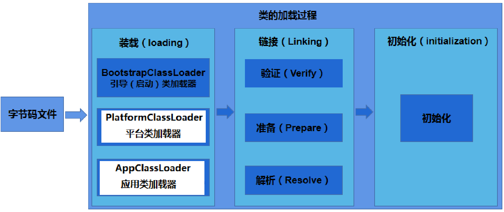
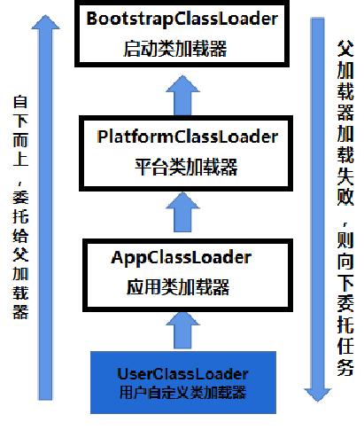

---
prev:
  text: "多线程"
  link: "/backend/java/java09"

next:
  text: "注解"
  link: "/backend/java/java11"
---

# 10. 反射机制

## 10.1 反射机制概述 :star:

反射机制是 JDK 中的一套类库，可以帮助我们操作或读取 class 字节码文件。

- `java.lang.Class`: Class 类型的实例代表硬盘上的某个 class 文件，或者说代表某一种类型。
- `java.lang.reflect.Field`: Field 类型的实例代表 class 文件中的成员变量。
- `java.lang.reflect.Method`: Method 类型的实例代表 class 文件中的方法。
- `java.lang.reflect.Constructor`: Constructor 类型的实例代表 class 文件中的构造方法。

## 10.2 获取 Class :white_check_mark:

获取 Class 的四种方式

1. **静态方法**

`Class clazz = Class.forName("全限定类名");` 这个方法的执行会导致类的加载（初始化）。

```Java
Class stringClass = Class.forName("java.lang.String");
// 表示硬盘上的 String.class 文件
```

2. **实例方法**

`Class clazz = 引用.getClass();` 这个方法通过引用调用。

```Java
String s1 = "abc";
Class stringClass2 = s1.getClass();
// 某种类型的字节码文件在内存中只有一份
// stringClass2 和 stringClass 都代表同一种类型 String 类型
System.out.println(stringClass2 == stringClass); // true
```

3. **class 属性**

`Class clazz = 类型名.class;`

```Java
Class intClass = int.class;
Class doubleClass = double.class;
Class stringClass = String.class;
Class booleanClass = boolean.class;
Class userClass = User.class;
```

4. **通过类加载器获取**

```Java
ClassLoader classLoader = ClassLoader.getSystemClassLoader();
Class clazz = classLoader.loadClass("全限定类名");
```

5. Class.forName 和 classLoader.loadClass() 的区别？

- `Class.forName()`：类加载时会进行初始化。
- `classLoader.loadClass()`：类加载时不会进行初始化，直到第一次使用该类。

## 10.3 反射作用的体现 :rocket:

通过反射机制可以实例化对象。

```Java
// 资源绑定器
ResourceBundle bundle =
  ResourceBundle.getBundle("com.example.javatest09.classInfo");
// 通过key获取value
String className = bundle.getString("className");
try {
    // 通过反射机制实例化对象
    Class classObj = Class.forName(className);
    Object obj = classObj.newInstance();
    System.out.println(obj);
} catch (Exception e) {
    throw new RuntimeException(e);
}
```

## 10.4 反射 Field Method :white_check_mark:

### 反射 Field 的常用方法 :white_check_mark:

**获取字段信息**

- `String getName()`: 返回字段的名称。
- `Class<?> getType()`: 返回字段的类型，即表示字段类型的 Class 对象。
- `Type getGenericType()`: 返回字段的泛型类型，如果字段不是泛型或不支持泛型，则返回与 getType() 相同的结果。
- `int getModifiers()`: 返回字段的修饰符集合，如 public, static, final 等，以整数形式表示。可以使用 Modifier 类的静态方法（如 Modifier.isPublic(int)）来判断修饰符。
- `boolean isSynthetic()`: 检查该字段是否由编译器或工具生成，而不是在源代码中直接声明。

**访问字段值**

- `Object get(Object obj)`: 从给定对象实例上获取该字段的值。对于非静态字段，需要传入对象实例；对于静态字段，可以传入 null 或一个实例对象。
- `void set(Object obj, Object value)`: 设置给定对象实例上该字段的值。同样，对于非静态字段需传入对象实例，静态字段可以传入 null 或任意实例。

**安全性与访问控制**

- `boolean isAccessible()`: 检查当前 Field 是否可访问。默认情况下，私有字段可能不可访问，除非通过 setAccessible(true) 显式设置。
- `void setAccessible(boolean accessible)`: 设置该 Field 是否允许访问。将 accessible 设置为 true 可以绕过 Java 访问控制检查，通常在需要访问私有或受保护字段时使用。

**注解相关**

- `<T extends Annotation> T getAnnotation(Class<T> annotationClass)`: 获取该字段上指定类型的注解实例。
- `Annotation[] getAnnotations()`: 返回该字段上所有注解组成的数组。
- `boolean isAnnotationPresent(Class<? extends Annotation> annotationClass)`: 判断该字段是否包含指定类型的注解。

**其他**

- `Class<?> getDeclaringClass()`: 返回声明该字段的类。
- `String toString()`: 返回表示该 Field 的字符串，通常包含其完全限定名以及修饰符等信息。

这些方法构成了 java.lang.reflect.Field 类的核心功能集，用于在运行时通过反射机制动态地获取和操作类的字段信息及值。使用时需要注意，反射操作可能会违反封装原则，应谨慎使用并在必要时确保其与应用程序的安全性和性能要求相兼容。
::: code-group

```Java [ReflectTest02.class]
public class ReflectTest02 {
    public static void main(String[] args) throws ClassNotFoundException {
        Class vipClass = Class.forName("com.example.javatest09.Vip");
        // 获取Vip类中所有 public 修饰的属性或字段
        Field[] fields = vipClass.getFields();
        System.out.println(fields.length);
        for (Field field : fields) {
            System.out.println(field.getName());
        }

        System.out.println("-----------------------");
        // 获取Vip类中所有的属性或字段，包括private修饰的
        Field[] fields2 = vipClass.getDeclaredFields();
        for (Field field : fields2) {
            Class fieldType = field.getType();
            // 获取类中的属性名称和对应的类型
            System.out.println(field.getName()+"----"+fieldType.getSimpleName());
        }
    }
}
```

```Java [Vip.class]
public class Vip {
    public String name;
    private int age;
    protected String birth;
    boolean gender;
    public static String address = "beijing";
    public static final String GRADE = "gold";

}
```

:::

### 通过反射为对象属性赋值 :white_check_mark:

```Java
Customer customer = new Customer();
// 获取类
Class clazz = Class.forName("com.example.javatest09.Customer");
// 获取对应的Field
Field nameField = clazz.getDeclaredField("name");

nameField.setAccessible(true);
// 修改属性的值
nameField.set(customer,"Tom");
// 读取属性的值
System.out.println(nameField.get(customer));
```

## 10.5 反射 Method :white_check_mark:

**获取方法信息**

- `getName()`: 返回此方法的名称。
- `getReturnType()`: 获取此方法返回值的 Class 对象。
- `getParameterTypes()`: 返回一个 Class 对象数组，这些对象表示此方法的参数类型。
- `getModifiers()`: 返回此方法的 Java 语言修饰符。
- `getDeclaringClass()`: 返回表示声明此 Method 的类或接口的 Class 对象。

**调用方法**

- `invoke(Object obj, Object... args)`: 对带有指定参数的指定对象调用此 Method 对象所表示的方法。

**其他方法**

- `isAccessible()`: 检查此方法是否可以通过此 Method 对象访问。
- `setAccessible(boolean flag)`: 设置此方法的可访问性。

```Java
Class clazz = Class.forName("com.example.javatest09.UserService");
Method[] methods = clazz.getDeclaredMethods();
for (Method method : methods) {
    // 方法修饰符
    System.out.println(Modifier.toString(method.getModifiers()));
    // 方法返回值类型
    System.out.println(method.getReturnType().getName());
    // 方法名
    System.out.println(method.getName());
    // 方法的参数列表
    Class<?>[] parameterTypes = method.getParameterTypes();
    for (Class parameterType : parameterTypes) {
        System.out.println(parameterType.getName());
    }
}
```

通过反射调用方法：

::: code-group

```Java [main]
UserService userService = new UserService();

Class clazz = Class.forName("com.example.javatest09.UserService");
Method loginMethod =
  clazz.getDeclaredMethod("login", String.class, String.class);
Object value = loginMethod.invoke(userService,"admin","123456");
System.out.println(value);
```

```Java [UserService.class]
public class UserService {
    public boolean login(String username,String password) {
        if("admin".equals(username) && "123456".equals(password)) {
            return true;
        }
        return true;
    }

    public void logout() {
        System.out.println("退出登录..");
    }
}
```

:::

## 10.6 反射 Constructor Method :white_check_mark:

`java.lang.reflect.Constructor` 是 Java 反射 API 的一部分，它代表某个类的构造方法。你可以使用 Constructor 类来动态地创建类的实例，或者获取构造方法的参数类型等信息。以下是一些 Constructor 类的常用方法：

- `newInstance(Object... initargs)`

使用此 Constructor 对象表示的构造方法来创建该构造方法的声明类的新实例，并用指定的初始化参数初始化该实例。

```Java
Constructor<MyClass> constructor =
    MyClass.class.getConstructor(String.class);
MyClass obj = constructor.newInstance("Hello");
```

- `getParameterTypes()`

返回一个 Class 对象的数组，这些对象表示此 Constructor 对象所表示构造方法的形参类型。

```Java
Class<?>[] paramTypes = constructor.getParameterTypes();
```

- `getParameterCount()`

返回此 Constructor 对象所表示构造方法的形参个数。

```Java
int paramCount = constructor.getParameterCount();
```

- `getModifiers()`

返回此 Constructor 对象所表示构造方法的 Java 语言修饰符，这些修饰符被编码在一个整数中。

```Java
int modifiers = constructor.getModifiers();
```

- `isAccessible()`

指示此 Constructor 对象是否可从此 Java 虚拟机中访问。

```Java
boolean accessible = constructor.isAccessible();
```

- `setAccessible(boolean flag)`

将此 Constructor 对象标记为可访问的或不可访问的。

```Java
constructor.setAccessible(true); // 允许访问私有构造方法
```

- `getDeclaringClass()`

返回表示此 Constructor 对象所表示构造方法的声明类的 Class 对象。

```Java
Class<?> declaringClass = constructor.getDeclaringClass();
```

- `getName()`

返回此 Constructor 对象所表示构造方法的名称。

```Java
String name = constructor.getName();
```

- `toString()`

返回此 Constructor 对象的字符串表示形式，该字符串包含构造方法的修饰符和类型参数（如果有），构造方法的返回类型，构造方法的名称，以及构造方法的参数类型。

```Java
String str = constructor.toString();
```

使用 Constructor 时，请确保处理好可能抛出的异常，例如 InstantiationException、IllegalAccessException、InvocationTargetException 等。另外，频繁地使用反射可能会影响性能，因此在生产环境中需要谨慎使用。

反编译类的构造方法：

::: details 点我查看代码

```Java
public class ReflectTest06 {
    public static void main(String[] args) throws Exception {
        StringBuilder sb = new StringBuilder();
        // 获取类
        Class clazz = Class.forName("com.example.javatest09.Order");
        // 类的修饰符
        sb.append(Modifier.toString(clazz.getModifiers()));
        sb.append(" class ");
        // 类名
        sb.append(clazz.getName());
        sb.append(" extends ");
        // 父类名
        sb.append(clazz.getSuperclass().getName());
        // 实现的接口
        Class[] interfaces = clazz.getInterfaces();
        if (interfaces.length > 0) {
            sb.append(" implements ");
            for (int i = 0; i < interfaces.length; i++) {
                sb.append(interfaces[i].getName());
                if (i != interfaces.length - 1) {
                    sb.append(",");
                }
            }
        }
        sb.append("{\n");
        // 类体
        Constructor[] cons = clazz.getDeclaredConstructors();
        for (Constructor con : cons) {
            sb.append("\t");
            sb.append(Modifier.toString(con.getModifiers()));
            sb.append(con.getName());
            sb.append("(");
            Parameter[] parameters = con.getParameters();
            for (int i = 0; i < parameters.length; i++) {
                Parameter parameter = parameters[i];
                sb.append(parameter.getType().getName());
                sb.append(" ");
                sb.append(parameter.getName());
                if (i != parameters.length - 1) {
                    sb.append(",");
                }
            }
            sb.append("){}\n");
        }
        sb.append("}");
        System.out.println(sb);
    }
}
//    public class com.example.javatest09.Order extends java.lang.Object{
//        publiccom.example.javatest09.Order(java.lang.String arg0){}
//        publiccom.example.javatest09.Order(java.lang.String arg0,double arg1,java.lang.String arg2){}
//        publiccom.example.javatest09.Order(java.lang.String arg0,double arg1){}
//    }
```

:::

通过反射机制调用构造方法：

::: code-group

```Java [ReflectTest07.class]
public class ReflectTest07 {
    public static void main(String[] args) throws Exception{
        Order order = new Order("1002",1999,"finished");
        Class clazz = Class.forName("com.example.javatest09.Order");
        Constructor defaultCon = clazz.getDeclaredConstructor();
        Object obj = defaultCon.newInstance();
        System.out.println(obj);

        Constructor threeArgs = clazz.getDeclaredConstructor(String.class,double.class,String.class);
        Object obj2 = threeArgs.newInstance("1002",5999,"closed");
        System.out.println(obj2);
    }
}
// Order{no='null', price=0.0, state='null'}
// Order{no='1002', price=5999.0, state='closed'}
```

```Java [Order.class]
public class Order {
    private String no;
    private double price;
    private String state;

    public Order() {
    }
    public Order(String no) {
        this.no = no;
    }

    public Order(String no, double price) {
        this.no = no;
        this.price = price;
    }

    public Order(String no, double price, String state) {
        this.no = no;
        this.price = price;
        this.state = state;
    }

    public String getNo() {
        return no;
    }

    public void setNo(String no) {
        this.no = no;
    }

    public double getPrice() {
        return price;
    }

    public void setPrice(double price) {
        this.price = price;
    }

    public String getState() {
        return state;
    }

    public void setState(String state) {
        this.state = state;
    }

    @Override
    public String toString() {
        return "Order{" +
                "no='" + no + '\'' +
                ", price=" + price +
                ", state='" + state + '\'' +
                '}';
    }
}
```

:::

## 10.7 模拟框架的部分实现

::: code-group

```Java [ReflectTest08.class]
public class ReflectTest08 {
    public static void main(String[] args) throws Exception {
        ResourceBundle bundle = ResourceBundle.getBundle("com.example.javatest09.config");
        String className = bundle.getString("className");
        String methodName = bundle.getString("methodName");
        String parameterTypes = bundle.getString("parameterTypes");
        String parameterValues = bundle.getString("parameterValues");

        // 创建对象
        Class<?> clazz = Class.forName(className);
        Constructor<?> defaultCon = clazz.getDeclaredConstructor();
        Object obj = defaultCon.newInstance();

        // 获取方法
        String[] strParameterTypes = parameterTypes.split(",");
        Class[] classParameterTypes = new Class[strParameterTypes.length];
        for (int i = 0; i < strParameterTypes.length; i++) {
            classParameterTypes[i] = Class.forName(strParameterTypes[i]);
        }

        // 调用方法
        Method method = clazz.getDeclaredMethod(methodName, classParameterTypes);
        Object resultValue = method.invoke(obj,parameterValues.split(","));
        System.out.println(resultValue);
    }
}
```

```Java [config.properties]
className=com.example.javatest09.UserService
methodName=login
parameterTypes=java.lang.String,java.lang.String
parameterValues=admin,123456
```

```Java [UserService.class]
public class UserService {
    public boolean login(String username,String password) {
        if("admin".equals(username) && "123456".equals(password)) {
            return true;
        }
        return true;
    }

    public void logout() {
        System.out.println("退出登录..");
    }
}
```

:::

## 10.8 类加载及双亲委派机制 :star:

### 类加载的过程

1. 装载（loading）
   类加载器负责将类的 class 文件读入内存，并创建一个 java.lang.Class 对象
2. 链接(linking)

- 验证（Verify）
  确保加载类的信息符合 JVM 规范。
- 准备（Prepare）

  （1）正式为静态变量在方法区中开辟存储空间并设置默认值

  （2）`public static int k = 10;` 此时：k 会赋值 0

  （3）`public static final int f = 10;` 此时： f 会赋值 10

- 解析（Resolve）

  将虚拟机常量池内的符号引用替换为直接引用（地址）的过程。

3. 初始化（initialization）

   静态变量赋值，静态代码块执行

低版本的 JDK 中类加载器的名字：

- 启动类加载器：负责加载 `rt.jar`
- 扩展类加载器：`ext/*.jar`
- 系统类加载器：`classpath`



### 类加载器

1. 虚拟机内部提供了三种类加载器（Java 9+）：

- 启动类加载器（BootstrapClassLoader）：加载 Java 最核心的类，例如 String
- 平台类加载器（PlatformClassLoader）：加载 Java 平台扩展的类库，例如解析 XML 的
- 应用类加载器（AppClassLoader）：加载 classpath 中的
- 同时我们还可以自定义一个类加载器（UserClassLoader）

```Java
public class ReflectTest09 {
    public static void main(String[] args) {
        // 通过自定义的类获取的类加载器，又称应用加载器
        ClassLoader appClassLoader = ReflectTest09.class.getClassLoader();
        System.out.println("应用类加载器："+appClassLoader);
        // 获取应用加载器
        ClassLoader appClassLoader2 = ClassLoader.getSystemClassLoader();
        System.out.println("应用类加载器："+appClassLoader2);
        // 获取应用加载器
        ClassLoader appClassLoader3 = Thread.currentThread().getContextClassLoader();
        System.out.println("应用类加载器："+appClassLoader3);
    }
}
```

2. 获取类加载器: 可以通过 getParent() 方法一级一级获取当前类的"**父** 类加载器"。

### 双亲委派机制

1. 某个类加载器接收到加载类的任务时，通常委托给“父 类加载”完成加载。
2. 最“父 类加载器”无法加载时，一级一级向下委托加载任务。
3. 作用：

- 保护程序的安全。
- 防止类加载重复。



## 10.9 反射泛型 :star:

### 反射父类的泛型

::: code-group

```Java [Test.class]
public class Test {
    public static void main(String[] args) {
        // 获取类
        Class<Cat> catClass = Cat.class;
        // 获取当前类的父类泛型
        Type genericSuperclass = catClass.getGenericSuperclass();

        // 父类未用泛型时
        System.out.println(genericSuperclass instanceof Class);
        // 父类未用泛型时
        System.out.println(genericSuperclass instanceof ParameterizedType);

        if (genericSuperclass instanceof ParameterizedType) {
            // 转型为参数化类型
            ParameterizedType parameterizedType = (ParameterizedType) genericSuperclass;
            // 获取泛型数组
            Type[] actualTypeArguments = parameterizedType.getActualTypeArguments();
            for (Type a : actualTypeArguments) {
                // 获取泛型的具体类型名
                System.out.println(a.getTypeName());
                //java.lang.String
                //java.lang.Integer
                //java.lang.Double
            }
        }
    }
}
```

```Java [Animal.class]
public class Animal<X,Y,Z> {
    // ...
}
```

```Java [Cat.class]
public class Cat extends Animal<String,Integer,Double>{
    // ...
}
```

:::

### 反射接口的泛型

::: code-group

```Java [Test02.class]
public class Test02 {
    public static void main(String[] args) {
        Class<Mouse> mouseClass = Mouse.class;
        Type[] genericInterfaces = mouseClass.getGenericInterfaces();
        for (Type g : genericInterfaces) {
            if (g instanceof ParameterizedType) {
                // 转型为参数化类型
                ParameterizedType parameterizedType = (ParameterizedType) g;
                // 获取泛型数组
                Type[] actualTypeArguments = parameterizedType.getActualTypeArguments();
                for (Type a : actualTypeArguments) {
                    // 获取泛型的具体类型名
                    System.out.println(a.getTypeName());
                    // java.lang.String
                    // java.lang.Integer
                    // com.example.javatest10.Mouse
                }
            }
        }
    }
}
```

```Java [Flyable.class]
public interface Flyable<X, Y> {
    // ...
}
```

```Java [Mouse.class]
public class Mouse implements Flyable<String,Integer>, Comparable<Mouse> {
    // ...
    @Override
    public int compareTo(Mouse o) {
        return 0;
    }
}
```

:::

### 反射属性的泛型

::: code-group

```Java [Test03.class]
public class Test03 {
    public static void main(String[] args) throws Exception {
        Class<User> userClass = User.class;
        Field mapField = userClass.getDeclaredField("map");
        Type genericType = mapField.getGenericType();
        if (genericType instanceof ParameterizedType) {
            // 转型为参数化类型
            ParameterizedType parameterizedType = (ParameterizedType) genericType;
            // 获取泛型数组
            Type[] actualTypeArguments = parameterizedType.getActualTypeArguments();
            for (Type a : actualTypeArguments) {
                // 获取泛型的具体类型名
                System.out.println(a.getTypeName());
                // java.lang.Integer
                // java.lang.String
            }
        }
    }
}
```

```Java [User.class]
public class User {
    private Map<Integer,String> map;
    // ...
}
```

:::

### 反射方法参数的泛型

::: code-group

```Java [Test04.class]
public class Test04 {
    public static void main(String[] args) throws Exception {
        Class<MyClass> myClass = MyClass.class;
        Method method = myClass.getDeclaredMethod("m", List.class,List.class);
        Type[] genericParameterTypes = method.getGenericParameterTypes();
        for (Type g : genericParameterTypes) {
            if (g instanceof ParameterizedType) {
                // 转型为参数化类型
                ParameterizedType parameterizedType = (ParameterizedType) g;
                // 获取泛型数组
                Type[] actualTypeArguments = parameterizedType.getActualTypeArguments();
                for (Type a : actualTypeArguments) {
                    // 获取泛型的具体类型名
                    System.out.println(a.getTypeName());
                    // java.lang.String
                    // java.lang.Integer
                }
            }
        }
    }
}
```

```Java [MyClass.class]
public class MyClass {
    public void m(List<String> list,List<Integer> list2) {
        // ...
    }
}
```

:::

### 反射方法返回值的泛型

::: code-group

```Java [Test05.class]
public class Test05 {
    public static void main(String[] args) throws Exception {
        Class<MyClass> myClass = MyClass.class;
        Method method = myClass.getDeclaredMethod("m", List.class, List.class);
        Type genericReturnType = method.getGenericReturnType();

        if (genericReturnType instanceof ParameterizedType) {
            // 转型为参数化类型
            ParameterizedType parameterizedType = (ParameterizedType) genericReturnType;
            // 获取泛型数组
            Type[] actualTypeArguments = parameterizedType.getActualTypeArguments();
            for (Type a : actualTypeArguments) {
                // 获取泛型的具体类型名
                System.out.println(a.getTypeName());
                // java.lang.String
                // java.lang.Integer
            }
        }
    }
}
```

```Java [MyClass.class]
public class MyClass {
    public Map<String,Integer> m(List<String> list, List<Integer> list2) {
        // ...
        return null;
    }
}
```

:::

### 反射构造方法参数的泛型

::: code-group

```Java [Test06.class]
public class Test06 {
    public static void main(String[] args) throws Exception {
        Class<User> userClass = User.class;
        Constructor<User> con = userClass.getDeclaredConstructor(Map.class);
        Type[]  genericParameterTypes = con.getGenericParameterTypes();
        for (Type g : genericParameterTypes) {
            if (g instanceof ParameterizedType) {
                // 转型为参数化类型
                ParameterizedType parameterizedType = (ParameterizedType) g;
                // 获取泛型数组
                Type[] actualTypeArguments = parameterizedType.getActualTypeArguments();
                for (Type a : actualTypeArguments) {
                    // 获取泛型的具体类型名
                    System.out.println(a.getTypeName());
                    // java.lang.String
                    // java.lang.Integer
                }
            }
        }
    }
}
```

```Java [User.class]
public class User {
    public User(Map<String,Integer> map) {
        // ...
    }
}
```

:::

<a-back-top />

<reading-progress-bar/>