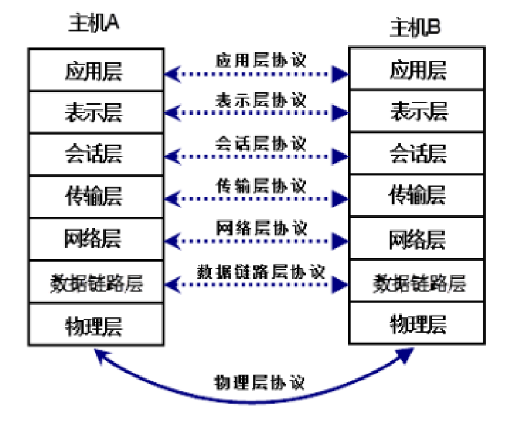
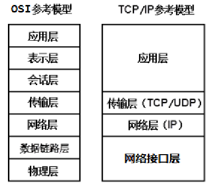
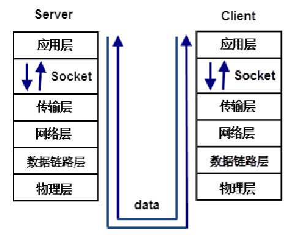
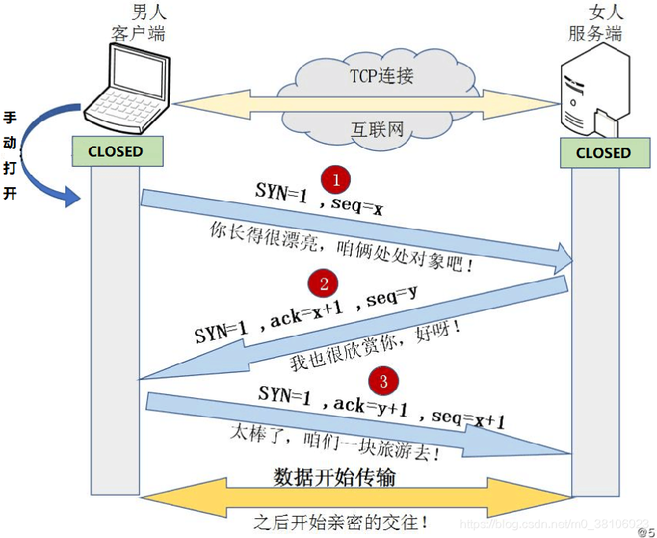
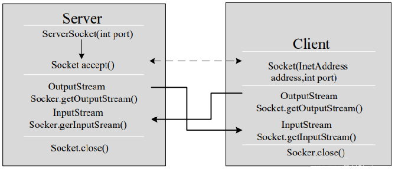

---
prev:
  text: "注解"
  link: "/backend/java/java11"

next:
  text: "Lambda 表达式"
  link: "/backend/java/java13"
---

# 12. 网络编程

## 12.1 网络编程概述 :star:

什么是网络编程？

网络编程是指利用计算机网络实现程序之间通信的一种编程方式。在网络编程中，程序需要通过网络协议（如 TCP/IP）来进行通信，以实现不同计算机之间的数据传输和共享。

## 12.2 网络编程三要素 :rocket:

在网络编程中，通常有三个基本要素：

- **IP 地址**：定位网络中某台计算机
- **端口号 port**：定位计算机上的某个进程（某个应用）
- **通信协议**：通过 IP 地址和端口号定位后，如何保证数据可靠高效的传输，这就需要依靠通信协议了。

### IP 地址

1. IP 地址用于唯一标识网络中的每一台计算机。在 Internet 上，使用 IPv4 或 IPv6 地址来表示 IP 地址。通常 IPv4 地址格式为 xxx.xxx.xxx.xxx，其中每个 xxx 都表示一个 8 位的**二进制数**（每一个 xxx 的取值范围是 0~255），组合起来可以表示 $2^{32}$ 个不同的 IP 地址。
2. IPv4 地址的总数量是 4294967296 个，但并不是所有的 IPv4 地址都可以使用。IPv4 地址被分为网络地址和主机地址两部分，前 3 个字节用于表示网络（省市区），最后 1 个字节用于表示主机（家门牌）。而一些 IP 地址被保留或者被私有机构使用，不能用于公网的地址分配。另外，一些 IP 地址被用作多播地址，仅用于特定的应用场景。因此实际上可供使用的 IPv4 地址数量要少于总数量，而且随着 IPv4 地址的逐渐枯竭，IPv6 地址已经开始逐渐普及，IPv6 地址数量更是相当巨大。
3. IPv6 使用 16 个字节表示 IP 地址(128 位)，这样就解决了网络地址资源数量不够的问题。IPv6 地址由 8 组 16 位**十六进制数**表示，每组之间用冒号分隔，如：3ffe:3201:1401:1280:c8ff:fe4d:db39:1984
4. 本机地址：`127.0.0.1`，主机名：`localhost`。
5. 192.168.0.0 ~ 192.168.255.255 为私有地址，属于非注册地址，专门为组织机构内部使用。

### IP 地址相关的：域名与 DNS

1. 域名

IP 地址毕竟是数字标识，使用时不好记忆和书写，因此在 IP 地址的基础上又发展出一种符号化的地址方案，来代替数字型的 IP 地址。每一个符号化的地址都与特定的 IP 地址对应。这个与网络上的数字型 IP 地址相对应的字符型地址，就被称为域名。
目前域名已经成为互联网品牌、网上商标保护必备的要素之一，除了识别功能外，还有引导、宣传等作用。如：www.baidu.com

2. DNS

在 Internet 上域名与 IP 地址之间是一对一（或者多对一）的，域名虽然便于人们记忆，但机器之间只能互相认识 IP 地址，它们之间的转换工作称为域名解析，域名解析需要由专门的域名解析服务器来完成，DNS（Domain Name System 域名系统）就是进行域名解析的服务器，域名的最终指向是 IP。

### 端口号（port）

1. 在计算机中，不同的应用程序是通过端口号区分的。
2. 端口号是用两个字节（无符号）表示的，它的取值范围是 0~65535，而这些计算机端口可分为 3 大类：

- 公认端口：0~1023。被预先定义的服务通信占用（如：HTTP 占用端口 80，FTP 占用端口 21，Telnet 占用端口 23 等）
- 注册端口：1024~49151。分配给用户进程或应用程序。（如：Tomcat 占用端口 8080，MySQL 占用端口 3306，Oracle 占用端口 1521 等）。
- 动态/私有端口：49152~65535。

3. **通常情况下，服务器程序使用固定的端口号来监听客户端的请求，而客户端则使用随机端口连接服务器**。
4. IP 地址好比每个人的地址（门牌号），端口好比是房间号。必须同时指定 IP 地址和端口号才能够正确的发送数据。

### 通信协议

1. 通过计算机网络可以使多台计算机实现连接，位于同一个网络中的计算机在进行连接和通信时需要遵守一定的规则。就像两个人想要顺利沟通就必须使用同一种语言一样，如果一个人只懂英语而另外一个人只懂中文，这样就会造成没有共同语言而无法沟通。
2. 在计算机网络中，这些连接和通信的规则被称为网络通信协议，它对数据的传输格式、传输速率、传输步骤等做了统一规定，通信双方必须同时遵守才能完成数据交换。
3. 在计算机网络中，常用的协议有 TCP、UDP、HTTP、FTP 等。这些协议规定了数据传输的格式、传输方式和传输顺序等细节。其中，TCP（传输控制协议）是一种可靠的面向连接的协议，它提供数据传输的完整性保证；而 UDP（用户数据报协议）则是一种无连接的协议，传输效率高。在网络编程中，需要选取合适的协议类型来实现数据传输。

### OSI 参考模型

1. 世界上第一个网络体系结构由 IBM 公司提出（1974 年，SNA），以后其他公司也相继提出自己的网络体系结构如：Digital 公司的 DNA，美国国防部的 TCP/IP 等，多种网络体系结构并存，其结果是若采用 IBM 的结构，只能选用 IBM 的产品，只能与同种结构的网络互联。
2. 为了促进计算机网络的发展，国际标准化组织 ISO（International Organization for Standardization）于 1977 年成立了一个委员会，在现有网络的基础上，提出了不基于具体机型、操作系统或公司的网络体系结构，称为开放系统互连参考模型，即 OSI/RM （Open System Interconnection Reference Model）。OSI 模型把网络通信的工作分为 7 层，分别是**物理层、数据链路层、网络层、传输层、会话层、表示层和应用层**。OSI 七层协议模型如图所示：



### TCP/IP 参考模型

1. OSI 参考模型的初衷是提供全世界范围的计算机网络都要遵循的统一标准，但是由于存在模型和协议自身的缺陷，迟迟没有成熟的产品推出。TCP/IP 协议在实践中不断完善和发展取得成功，作为网络的基础，Internet 的语言，可以说没有 TCP/IP 参考模型就没有互联网的今天。
2. TCP/IP，即 Transmission Control Protocol/Internet Protocol 的简写，中译名为传输控制协议/因特网互联协议，是 Internet 最基本的协议、Internet 国际互联网络的基础。
3. TCP/IP 协议是一个开放的网络协议簇，它的名字主要取自最重要的网络层 IP 协议和传输层 TCP 协议。TCP/IP 协议定义了电子设备如何连入因特网，以及数据如何在它们之间传输的标准。TCP/IP 参考模型采用 4 层的层级结构，每一层都呼叫它的下一层所提供的协议来完成自己的需求，这 4 个层次分别是：**网络接口层、互联网层（IP 层）、传输层（TCP 层）、应用层**。
4. OSI 模型与 TCP/IP 模型的对应关系如图所示：



### OSI 参考模型 与 TCP/IP 参考模型的区别

1. OSI 参考模型是理论上的，而 TCP/IP 参考模型是实践上的。TCP/IP 参考模型被许多实际的协议（如 IP、TCP、HTTP 等）所支持和实现，而 OSI 参考模型则主要是作为理论框架和标准进行研究和讨论。
2. OSI 参考模型是由国际标准化组织提出的网络通信协议框架，其中分为 7 层，各层之间明确了功能的划分，从物理层到应用层，逐层向上升，每层只对自己下一层提供服务，并依次封装和解封数据。OSI 参考模型是一种理论上的协议框架，用于描述计算机系统间的通信原理和规范。
3. TCP/IP 参考模型（也称互联网参考模型）是实际应用中最广泛的协议框架。它将网络协议划分为 4 层：网络接口层、网络层、传输层和应用层。TCP/IP 参考模型与 OSI 参考模型之间有着相对应的层次结构，但是其中的每一层都是实际存在的协议，而不是纯粹的框架。TCP/IP 参考模型被广泛应用于互联网上，是计算机系统间进行通信的重要基础。

## 12.3 网络编程基础类 :white_check_mark:

### InetAddress 类

1. java.net.IntAddress 类用来封装计算机的 IP 地址和 DNS（没有端口信息），它包括一个主机名和一个 IP 地址，是 java 对 IP 地址的高层表示。大多数其它网络类都要用到这个类，包括 Socket、ServerSocket、URL、DatagramSocket、DatagramPacket 等
2. 常用静态方法

- `static InetAddress getLocalHost()`: 得到本机的 InetAddress 对象，其中封装了 IP 地址和主机名
- `static InetAddress getByName(String host)`: 传入目标主机的名字或 IP 地址得到对应的 InetAddress 对象，其中封装了 IP 地址和主机名（底层会自动连接 DNS 服务器进行域名解析）

3. 常用实例方法

- `public String getHostAddress()`: 获取 IP 地址
- `public String getHostName()`: 获取主机名/域名

### URL 类

1. URL 是统一资源定位符，对可以从互联网上得到的资源的位置和访问方法的一种简洁的表示，是互联网上标准资源的地址。互联网上的每个文件都有一个唯一的 URL，它包含的信息指出文件的位置以及浏览器应该怎么处理它。
2. URL 由 4 部分组成：协议、存放资源的主机域名、端口号、资源文件名。如果未指定该端口号，则使用协议默认的端口。例如 HTTP 协议的默认端口为 80。在浏览器中访问网页时，地址栏显示的地址就是 URL。
3. URL 标准格式为：<协议>://<域名或 IP>:<端口>/<路径>。其中，<协议>://<域名或 IP>是必需的，<端口>/<路径>有时可省略。如：https://www.baidu.com。
4. 为了方便程序员编程，JDK 中提供了 URL 类，该类的全名是 java.net.URL，该类封装了大量复杂的涉及从远程站点获取信息的细节，可以使用它的各种方法来对 URL 对象进行分割、合并等处理。
5. URL 类的构造方法：`URL url = new URL("http://127.0.0.1:8080/oa/index.html?name=zhangsan#tip");`
6. URL 类的常用方法：

- 获取协议：`url.getProtocol()`
- 获取域名：`url.getHost()`
- 获取默认端口：`url.getDefaultPort()`
- 获取端口：`url.getPort()`
- 获取路径：`url.getPath()`
- 获取资源：`url.getFile()`
- 获取数据：`url.getQuery()`
- 获取锚点：`url.getRef()`

7. 使用 URL 类的 `openStream()` 方法可以打开到此 URL 的连接并返回一个用于从该连接读入的 InputStream，实现最简单的网络爬虫

## 12.4 TCP 与 UDP 协议 :white_check_mark:

### Socket 套接字概述

1. 我们开发的网络应用程序位于应用层，TCP 和 UDP 属于传输层协议，在应用层如何使用传输层的服务呢？在应用层和传输层之间，则是使用套接 Socket 来进行分离。
2. 套接字就像是传输层为应用层开的一个小口，应用程序通过这个小口向远程发送数据，或者接收远程发来的数据。而这个小口以内，也就是数据进入这个口之后，或者数据从这个口出来之前，是不知道也不需要知道的，也不会关心它如何传输，这属于网络其它层次工作。
3. Socket 实际是传输层供给应用层的编程接口。Socket 就是应用层与传输层之间的桥梁。使用 Socket 编程可以开发客户机和服务器应用程序，可以在本地网络上进行通信，也可通过 Internet 在全球范围内通信。
4. TCP 协议和 UDP 协议是传输层的两种协议。Socket 是传输层供给应用层的编程接口，所以 Socket 编程就分为 TCP 编程和 UDP 编程两类。



### TCP 协议

1. 使用 TCP 协议，须先建立 TCP 连接，形成传输数据通道，似于拨打电话。
2. 传输前，采用“三次握手”方式，属于点对点通信，是面向连接的，效率低。
3. 仅支持单播传输，每条 TCP 传输连接只能有两个端点（客户端、服务端）。
4. 两个端点的数据传输，采用的是“字节流”来传输，属于可靠的数据传输。
5. 传输完毕，需释放已建立的连接，开销大，速度慢，适用于文件传输、邮件等。

### UDP 协议

1. 采用数据报（数据、源、目的）的方式来传输，无需建立连接，类似于发短信。
2. 每个数据报的大小限制在 64K 内，超出 64k 可以分为多个数据报来发送。
3. 发送不管对方是否准备好，接收方即使收到也不确认，因此属于不可靠的。
4. 可以广播发送，也就是属于一对一、一对多和多对一连接的通信协议。
5. 发送数据结束时无需释放资源，开销小，速度快，适用于视频会议、直播等。

| 描述         | TCP                                | UDP                                |
| ------------ | ---------------------------------- | ---------------------------------- |
| 是否连接     | 面向连接                           | 面向非连接                         |
| 传输可靠性   | 可靠                               | 不可靠                             |
| 连接对象个数 | 一对一                             | 一对一、一对多、多对一             |
| 传输方式     | 面向字节流                         | 面向报文                           |
| 传输速度     | 慢                                 | 快                                 |
| 应用场景     | 适用于可靠传输（文件传输、邮件等） | 适用于实时应用（视频会议、直播等） |

### TCP 协议的三次握手（通道建立）

TCP（传输控制协议）是一种面向连接的、可靠的传输层协议。它使用三次握手来建立连接，以确保数据在两个设备之间可靠地传输。

**三次握手的过程如下**：

1. 客户端发送 SYN（同步）数据包。这个数据包包含客户端的初始序列号（ISN）。
2. 服务器收到 SYN 数据包后，发送 SYN-ACK（同步确认）数据包。这个数据包包含服务器的初始序列号（ISN）和对客户端 ISN 的确认号（ACK）。
3. 客户端收到 SYN-ACK 数据包后，发送 ACK（确认）数据包。这个数据包包含对服务器 ISN 的确认号（ACK）。

三次握手完成后，客户端和服务器就可以开始交换数据了。

**三次握手的意义**：

三次握手可以确保数据在两个设备之间可靠地传输。它可以防止以下情况的发生：

- 不会丢失：如果没有三次握手，客户端和服务器可能会同时发送数据，导致数据丢失。
- 不会重复：如果没有三次握手，客户端和服务器可能会重复发送数据，导致数据重复。
- 不会乱序：如果没有三次握手，客户端和服务器可能会乱序发送数据，导致数据乱序。



### TCP 协议的四次挥手（通道关闭）

使用四次挥手来关闭连接，以确保数据在两个设备之间可靠地传输。

**四次挥手的过程如下**：

1. 客户端发送 FIN（结束）数据包。这个数据包表示客户端已经完成数据传输，并希望关闭连接。
2. 服务器收到 FIN 数据包后，发送 ACK（确认）数据包。这个数据包表示服务器已经收到客户端的 FIN 数据包，并同意关闭连接。
3. 服务器发送 FIN 数据包。这个数据包表示服务器已经完成数据传输，并希望关闭连接。
4. 客户端收到 FIN 数据包后，发送 ACK（确认）数据包。这个数据包表示客户端已经收到服务器的 FIN 数据包，并同意关闭连接。四次挥手完成后，客户端和服务器之间的连接就关闭了。

**四次挥手的意义**:

四次挥手可以确保数据在两个设备之间可靠地传输。它可以防止以下情况的发生：

- 如果没有四次挥手，客户端和服务器可能会同时关闭连接，导致数据丢失。
- 如果没有四次挥手，客户端和服务器可能会重复发送数据，导致数据重复。
- 如果没有四次挥手，客户端和服务器可能会乱序发送数据，导致数据乱序。


## 12.5 基于 TCP 协议的编程 :rocket:

### TCP 协议编程概述

1. 套接字是一种进程间的数据交换机制，利用套接字(Socket)开发网络应用程序早已被广泛的采用，以至于成为事实上的标准。
2. 在网络通讯中，第一次主动发起通讯的程序被称作客户端(Client)，而在第一次通讯中等待连接的程序被称作服务端(Server)。一旦通讯建立，则客户端和服务器端完全一样，没有本质的区别。
3. 套接字与主机地址和端口号相关联，主机地址就是客户端或服务器程序所在的主机的 IP 地址，端口地址是指客户端或服务器程序使用的主机的通信端口。在客户端和服务器中，分别创建独立的 Socket，并通过 Socket 的属性，将两个 Socket 进行连接，这样客户端和服务器通过套接字所建立连接并使用 IO 流进行通信。


### Socket 类概述

1. Socket 类实现客户端套接字(Client），套接字是两台机器间通信的端点
2. Socket 类构造方法：
   `public Socket(InetAddress a, int p)`：创建套接字并连接到指定 IP 地址的指定端口号
3. Socket 类实例方法：

- `public InetAddress getInetAddress()`: 返回此套接字连接到的远程 IP 地址。
- `public InputStream getInputStream()`: 返回此套接字的输入流（接收网络消息）。
- `public OutputStream getOutputStream()`: 返回此套接字的输出流（发送网络消息）。
- `public void shutdownInput()`: 禁用此套接字的输入流
- `public void shutdownOutput()`: 禁用此套接字的输出流。
- `public synchronized void close()`: 关闭此套接字（默认会关闭 IO 流）。

### ServerSocket 类概述

1. ServerSocket 类用于实现服务器套接字(Server 服务端)。服务器套接字等待请求通过网络传入。它基于该请求执行某些操作，然后可能向请求者返回结果
2. ServerSocket 构造方法：

`public ServerSocket(int port)`

1. ServerSocket 实例方法：

- `public Socket accept()`: 侦听要连接到此套接字并接受它。
- `public InetAddress getInetAddress()`: 返回此服务器套接字的本地地址。
- `public void close()`: 关闭此套接字。

### TCP 单向通讯的实现

Java 语言的基于套接字编程分为服务端编程和客户端编程，其通信模型如图所示。



服务器端实现步骤：

1. 创建 ServerSocket 对象，绑定并监听端口；
2. 通过 accept 监听客户端的请求；
3. 建立连接后，通过输出输入流进行读写操作；
4. 调用 close()方法关闭资源。

客户端实现步骤：

1. 创建 Socket 对象，指定服务端的地址和端口号；
2. 建立连接后，通过输入输出流进行读写操作；
3. 通过输出输入流获取服务器返回信息；
4. 调用 close()方法关闭资源。

注意：一定是先启动服务器程序，然后再启动客户端程序，先后顺序千万别弄混了！

::: details 点我查看代码
::: code-group

```Java [Server.class]
public class Server {
    public static void main(String[] args) {
        ServerSocket serverSocket = null;
        Socket clientSocket = null;
        BufferedReader br = null;
        try {
            // 启动服务器
            int port = 8888;
            serverSocket = new ServerSocket(port);

            System.out.println("The server is running at port " + port);
            //接收客户端的请求
            clientSocket = serverSocket.accept();
            br = new BufferedReader(new InputStreamReader(clientSocket.getInputStream()));

            String s = null;
            while ((s = br.readLine()) != null) {
                System.out.println(s);
            }
        } catch (IOException e) {
            throw new RuntimeException(e);
        } finally {
            if (br != null) {
                try {
                    br.close();
                } catch (IOException e) {
                    throw new RuntimeException(e);
                }
            }
            if (clientSocket != null) {
                try {
                    clientSocket.close();
                } catch (IOException e) {
                    throw new RuntimeException(e);
                }
            }

            if (serverSocket != null) {
                try {
                    serverSocket.close();
                } catch (IOException e) {
                    throw new RuntimeException(e);
                }
            }
        }
    }
}

```

```Java [Client.class]
public static void main(String[] args) {
  Socket clientSocket = null;
  BufferedWriter bw = null;
  try {
      clientSocket = new Socket(InetAddress.getLocalHost(),8888);
      bw = new BufferedWriter(new OutputStreamWriter(clientSocket.getOutputStream()));

      Scanner scanner = new Scanner(System.in);
      while(true) {
          System.out.println("请输入消息：");
          String msg = scanner.next();
          bw.write(msg);
          bw.write("\n");
          bw.flush();
      }

  } catch (IOException e) {
      throw new RuntimeException(e);
  } finally {
      if(bw != null) {
          try {
              bw.close();
          } catch (IOException e) {
              throw new RuntimeException(e);
          }
      }
      if(clientSocket != null) {
          try {
              clientSocket.close();
          } catch (IOException e) {
              throw new RuntimeException(e);
          }
      }
  }
}

```

:::

### TCP 双向通讯的实现

在双向通讯的案例中，客户端需要向服务端发送一张图片，服务端收到客户端发送的图片后，则需要向客户端回复收到图片的反馈。在客户端给服务端发送图片的时候，图片发送完毕必须调用 shutdownOutput()方法来关闭 socket 输出流，否则服务端读取数据就会一直阻塞。

服务器端实现步骤：

1. 创建 ServerSocket 对象，绑定监听端口；
2. 通过 accept()方法监听客户端请求；
3. 使用输入流接收客户端发送的图片，然后通过输出流保存图片；
4. 通过输出流返回客户端图片收到；
5. 调用 close()方法关闭资源。

客户端实现步骤：

1. 创建 socket 对象，指明需要连接的服务器地址和端口号；
2. 建立连接后，通过输出流向服务器端发送图片；
3. 通过输入流获取服务器的响应信息；
4. 调用 close()方法关闭资源。

## 12.6 基于 UDP 协议的编程 :white_check_mark:

### UDP 协议编程概述

在 UDP 通信协议下，两台计算机之间进行数据交互，并不需要先建立连接，发送端直接往指定的 IP 和端口号上发送数据即可，但是它并不能保证数据一定能让对方收到，也不能确定什么时候可以送达。

java.net.DatagramSocket 类和 java.net.DatagramPacket 类是使用 UDP 编程中需要使用的两个类，并且发送端和接收端都需要使用这个俩类，并且发送端与接收端是两个独立的运行程序。

1. DatagramSocket：负责接收和发送数据，创建接收端时需要指定端口号。
2. DatagramPacket：负责把数据打包，创建发送端时需指定接收端的 IP 地址和端口。

### DatagramSocket 类的概述

1. DatagramSocket 类作为基于 UDP 协议的 Socket，使用 DatagramSocket 类可以用于接收和发送数据，同时创建接收端时还需指定端口号。
2. DatagramSocket 的构造方法：

- `public DatagramSocket()` 创建发送端的数据报套接字
- `public DatagramSocket(int port)` 创建接收端的数据报套接字，并指定端口号

3. DatagramSocket 的实例方法：

- `public void send(DatagramPacket p)` 发送数据报。
- `public void receive(DatagramPacket p)` 接收数据报。
- `public void close()` 关闭数据报套接字。

### 基于 UDP 编程的实现

接收端实现步骤

1. 创建 DatagramSocket 对象（接收端），并指定端口号；
2. 创建 DatagramPacket 对象（数据报）；
3. 调用 receive()方法，用于接收数据报；
4. 调用 close()方法关闭资源

发送端实现步骤

1. 创建 DatagramSocket 对象（发送端）；
2. 创建 DatagramPacket 对象（数据报），并指定接收端 IP 地址和端口；
3. 调用 send()方法，用于发送数据报；
4. 调用 close()方法关闭资源。

::: code-group

```Java [Send.class]
public class Send {
    public static void main(String[] args) throws Exception {
        DatagramSocket ds = new DatagramSocket();

        byte[] bytes = "hello world.".getBytes();
        DatagramPacket dp = new DatagramPacket(bytes, 0, bytes.length, InetAddress.getLocalHost(), 8888);

        ds.send(dp);
        ds.close();
    }
}
```

```Java [Receive.class]
public class Receive {
    public static void main(String[] args) throws Exception {
        DatagramSocket ds = new DatagramSocket(8888);

        byte[] bytes = new byte[64 * 1024];
        DatagramPacket dp = new DatagramPacket(bytes, bytes.length);
        ds.receive(dp);

        String msg = new String(bytes, 0, dp.getLength());
        System.out.println("接收到的消息：" + msg);
        ds.close();
    }
}

```

:::

<a-back-top />
