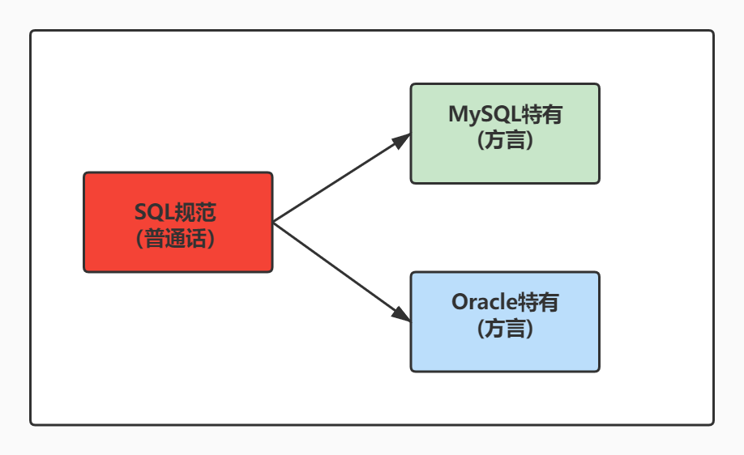
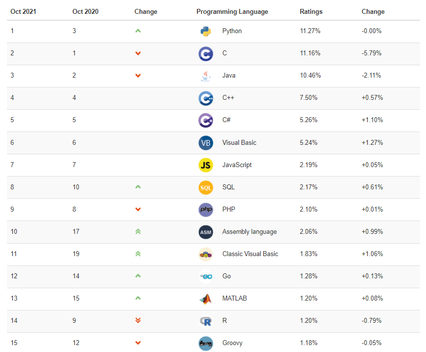

---
prev:
  text: "MySQL 环境搭建"
  link: "/backend/mysql/basic02"
next:
  text: "运算符"
  link: "/backend/mysql/basic04"
---

# 第 03 章 基本的SELECT语句

## 1. SQL概述

### 1.1 SQL背景知识

* 1946 年，世界上第一台电脑诞生，如今，借由这台电脑发展起来的互联网已经自成江湖。在这几十年里，无数的技术、产业在这片江湖里沉浮，有的方兴未艾，有的已经几幕兴衰。但在这片浩荡的波动里，有一门技术从未消失，甚至“老当益壮”，那就是 SQL。
  + 45 年前，也就是 1974 年，IBM 研究员发布了一篇揭开数据库技术的论文《SEQUEL：一门结构化的英语查询语言》，直到今天这门结构化的查询语言并没有太大的变化，相比于其他语言， SQL 的半衰期可以说是非常长了。

* 不论是前端工程师，还是后端算法工程师，都一定会和数据打交道，都需要了解如何又快又准确地提取自己想要的数据。更别提数据分析师了，他们的工作就是和数据打交道，整理不同的报告，以便指导业务决策。

* SQL（Structured Query Language，结构化查询语言）是使用关系模型的数据库应用语言， 与数据直接打交道，由IBM 上世纪70年代开发出来。后由美国国家标准局（ANSI）开始着手制定SQL标准，先后有SQL-86 ， SQL-89 ， SQL-92 ， SQL-99 等标准。
    - SQL 有两个重要的标准，分别是 SQL92 和 SQL99，它们分别代表了 92 年和 99 年颁布的 SQL 标准，我们今天使用的 SQL 语言依然遵循这些标准。
* 不同的数据库生产厂商都支持SQL语句，但都有特有内容。



### 1.2 SQL语言排行榜

自从 SQL 加入了 TIOBE 编程语言排行榜，就一直保持在 Top 10。



### 1.3 SQL 分类

SQL语言在功能上主要分为如下3大类：

* DDL（Data Definition Languages、数据定义语言），这些语句定义了不同的数据库、表、视图、索引等数据库对象，还可以用来创建、删除、修改数据库和数据表的结构。
  + 主要的语句关键字包括CREATE 、DROP 、ALTER 等。
* DML（Data Manipulation Language、数据操作语言），用于添加、删除、更新和查询数据库记录，并检查数据完整性。
  + 主要的语句关键字包括INSERT 、DELETE 、UPDATE 、SELECT 等。
  + SELECT是SQL语言的基础，最为重要。
* DCL（Data Control Language、数据控制语言），用于定义数据库、表、字段、用户的访问权限和安全级别。
  + 主要的语句关键字包括GRANT 、REVOKE 、COMMIT 、ROLLBACK 、SAVEPOINT 等。

> 因为查询语句使用的非常的频繁，所以很多人把查询语句单拎出来一类：DQL（数据查询语言）。
>  
> 还有单独将COMMIT 、> ROLLBACK 取出来称为TCL （Transaction Control Language，事务控制语言）。

## 2. SQL语言的规则与规范

### 2.1 基本规则

* QL 可以写在一行或者多行。为了提高可读性，各子句分行写，必要时使用缩进
* 每条命令以 ; 或 \g 或 \G 结束
* 关键字不能被缩写也不能分行
* 关于标点符号:
    - 必须保证所有的()、单引号、双引号是成对结束的
    - 必须使用英文状态下的半角输入方式
    - 字符串型和日期时间类型的数据可以使用单引号（' '）表示
    - 列的别名，尽量使用双引号（" "），而且不建议省略as

### 2.2 SQL大小写规范 （建议遵守）

* **MySQL 在 Windows 环境下是大小写不敏感的**
* **MySQL 在 Linux 环境下是大小写敏感的**
  + 数据库名、表名、表的别名、变量名是严格区分大小写的
  + 关键字、函数名、列名(或字段名)、列的别名(字段的别名) 是忽略大小写的。
* **推荐采用统一的书写规范**：
  + 数据库名、表名、表别名、字段名、字段别名等都小写
  + SQL 关键字、函数名、绑定变量等都大写

### 2.3 注 释

可以使用如下格式的注释结构

```shell
单行注释：#注释文字(MySQL特有的方式)
单行注释：-- 注释文字(--后面必须包含一个空格。)
多行注释：/* 注释文字 */
```

### 2.4 命名规则（暂时了解）

* 数据库、表名不得超过30个字符，变量名限制为29个
* 必须只能包含 A–Z, a–z, 0–9, _共63个字符
* 数据库名、表名、字段名等对象名中间不要包含空格
* 同一个MySQL软件中，数据库不能同名；同一个库中，表不能重名；同一个表中，字段不能重名
* 必须保证你的字段没有和保留字、数据库系统或常用方法冲突。如果坚持使用，请在SQL语句中使
用`（着重号）引起来
* 保持字段名和类型的一致性，在命名字段并为其指定数据类型的时候一定要保证一致性。假如数据
类型在一个表里是整数，那在另一个表里可就别变成字符型了

### 2.5 数据导入指令

## 3. 基本的SELECT语句

### 3.1 SELECT...

### 3.2 SELECT ... FROM

### 3.3 列的别名

### 3.4 去除重复行

### 3.5 空值参与运算

### 3.6 着重号

## 4. 显示表结构

## 5. 过滤数据

<a-back-top />

<reading-progress-bar/>
